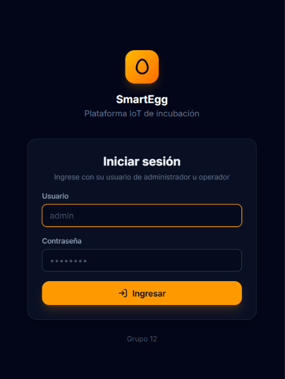
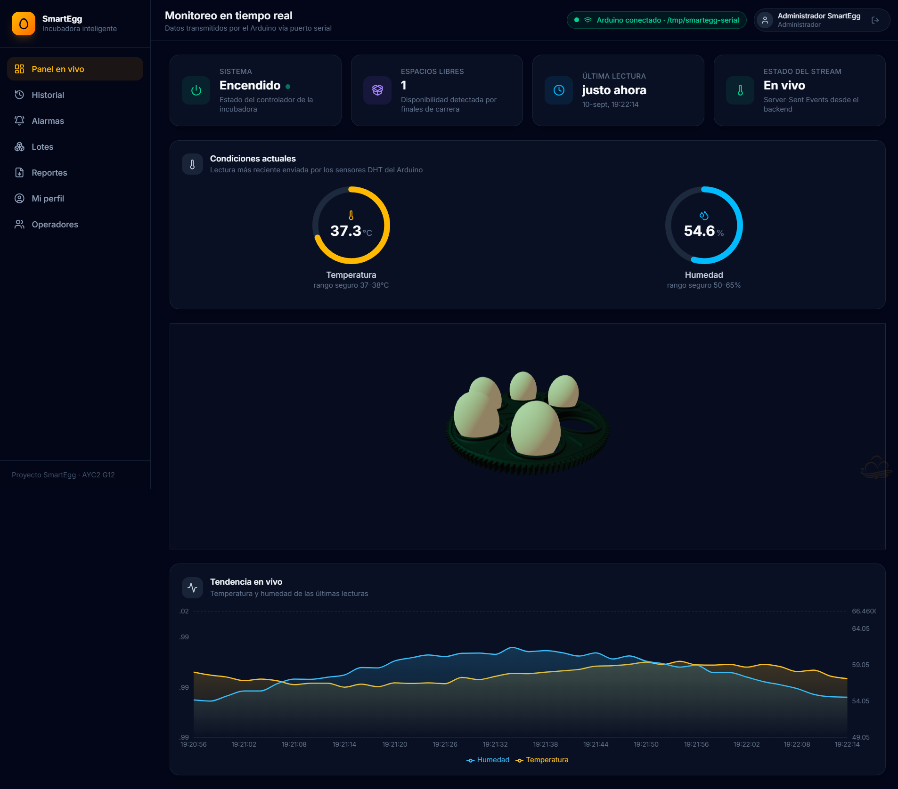
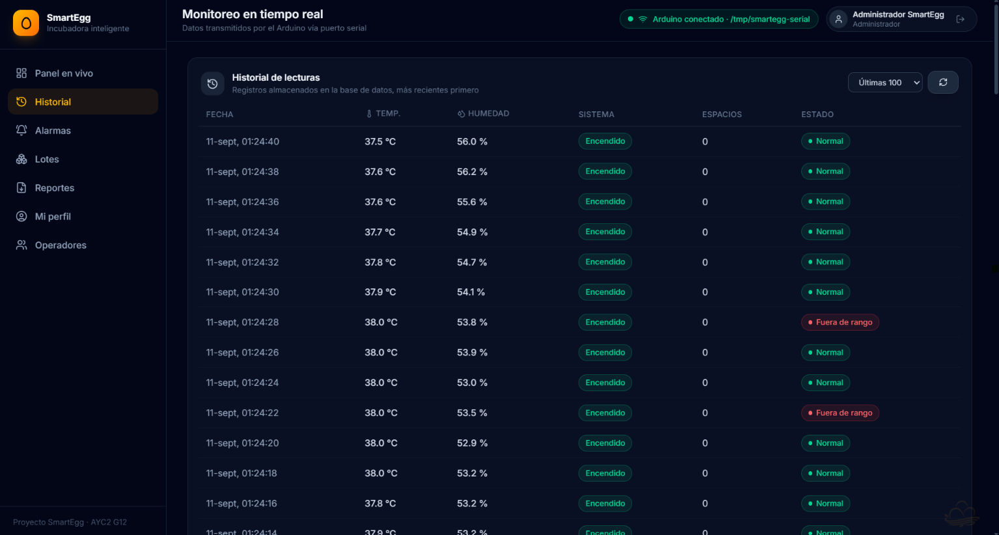
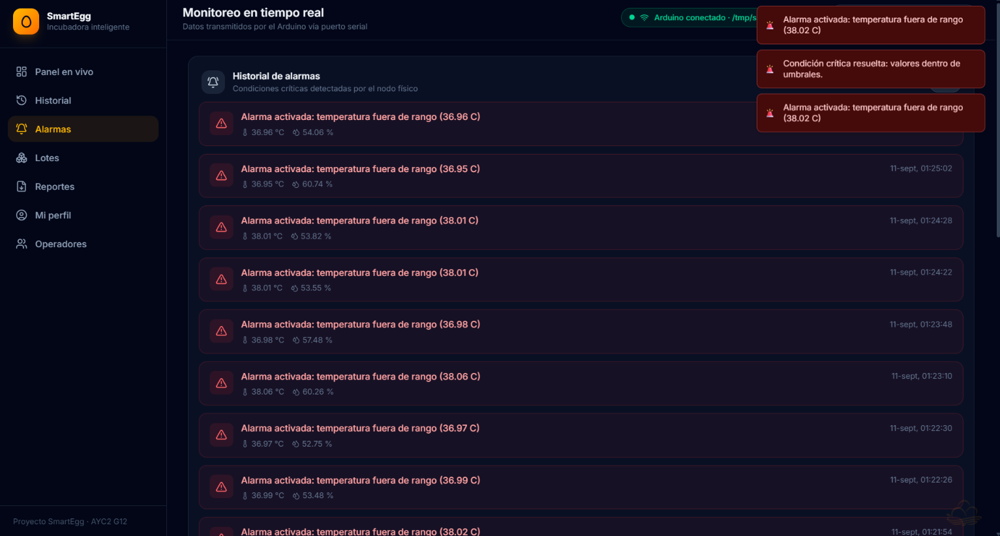
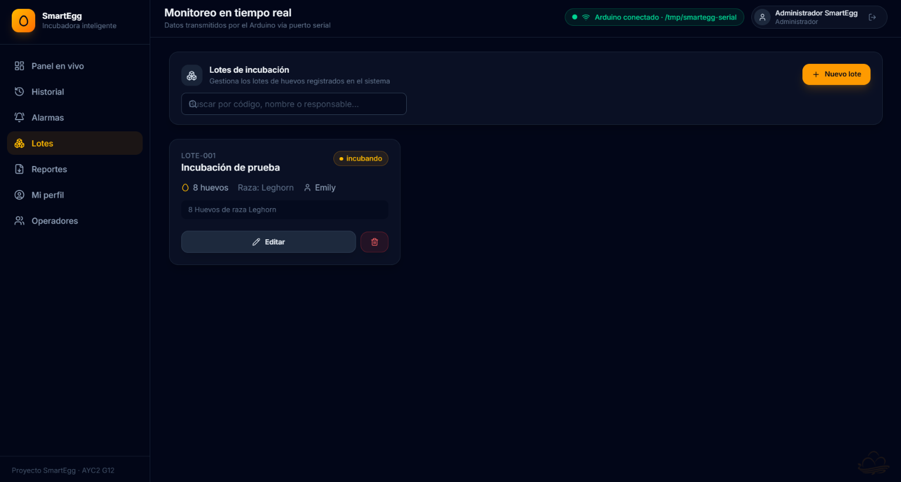
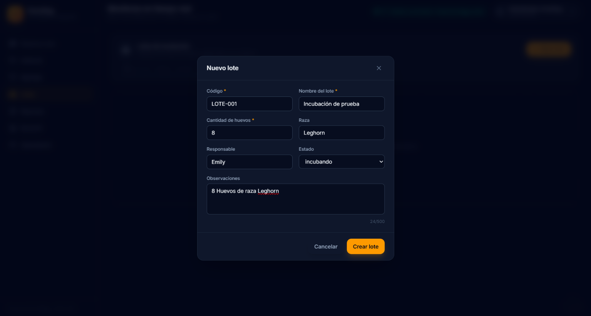
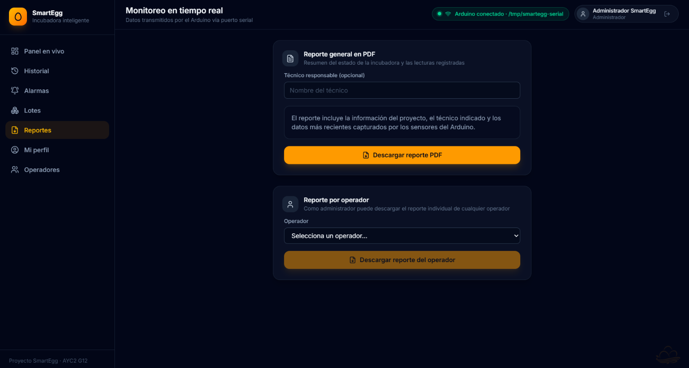
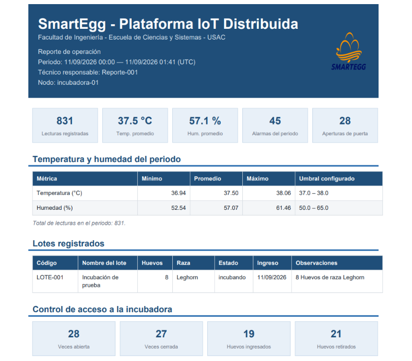
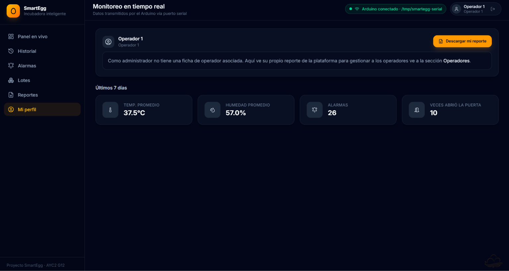
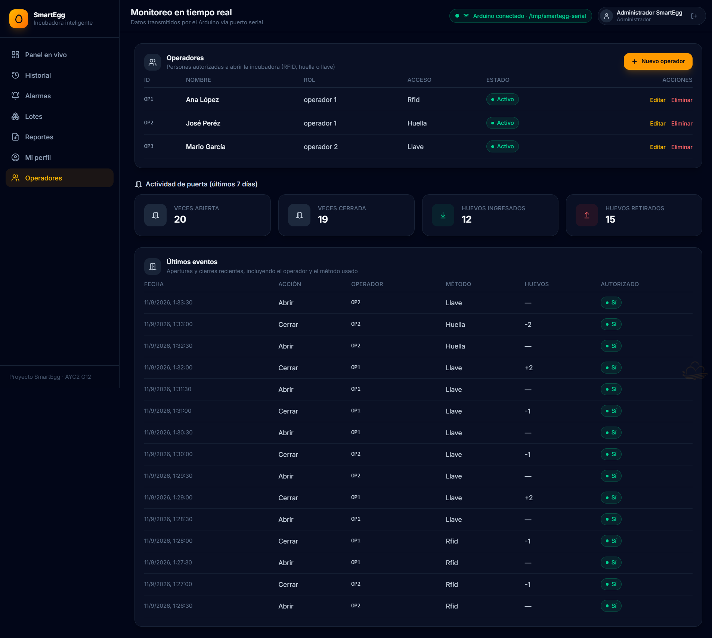

# Manual de Usuario — SmartEgg

Este manual explica cómo utilizar la plataforma web de SmartEgg: cómo iniciar sesión, qué puede hacer cada tipo de usuario, y cómo realizar las tareas principales del sistema.

## 1. Acceso al sistema

Para ingresar a la plataforma, debe abrir la URL de la aplicación y podrá ver la pantalla de inicio de sesión, en donde podrá iniciar sesión como administrador u operador ingresando el nombre de usuario y contraseña correcta. Si los datos son incorrectos, el sistema mostrará un mensaje de error y no dejará ingresar.

Ingresa el usuario y contraseña, según el rol:

| Rol | Usuario | Contraseña | Qué puede hacer |
|---|---|---|---|
| Administrador | `admin` | `admin123` | Ver todo el sistema, gestionar operadores, descargar reportes de cualquier operador |
| Operador 1 | `operador1` | `operador1` | Ver el estado de la incubadora, su propio perfil y su propio reporte |
| Operador 2 | `operador2` | `operador2` | Igual que Operador 1 |

> **Nota:** Estas son las credenciales por defecto que el sistema crea
> automáticamente la primera vez que arranca (configurables en el `.env`
> del backend/infra). Son válidas para pruebas y para esta entrega
> académica; en un entorno real de producción deberían cambiarse antes de
> exponer el sistema, usando `POST /api/auth/cambiar-password`.

## 2. Panel principal (Dashboard)

Al iniciar sesión, se muestra el panel en vivo con la temperatura, humedad, estado de los actuadores (calefacción, ventilación, rotación) y espacios
disponibles mostrando los espacios de la incubadora con los huevos, siendo actualizado en tiempo real.

También puede visualizar que del lado izquierdo se muestra una barra de más acciones: panel en vivo, historial, alarmas, lotes, reportes, 
mi perfil y operadores en donde podrá realizar diferentes acciones y visualizar el sistema.

## 3. Historial

En la sección "Historial" se pueden consultar las lecturas de temperatura y humedad con su respectiva fecha y hora, mostrnado el estado del sistema, 
los espacios disponibles y el sistema a lo largo del tiempo y al regresar al panel en vivo podrá visualizar la gráfica de tendencia de estos datos.

## 4. Alarmas en tiempo real

Cuando la temperatura o humedad salen de rango, aparecerá una notificación visible en cualquier pantalla del sistema, en tiempo real 
(a través del broker MQTT), sin necesidad de recargar la página, estas notificaciones serán visibles por algunos segundos pero siempre 
podrá visualizarlas en el panel de "Alarmas" en donde se msotrarán sus datos.

## 5. Lotes de huevos

En la sección "Lotes" se puede:
- Visualizar la lista de lotes registrados
- Registrar un nuevo lote con el botón "Nuevo lote" (código, nombre, cantidad de huevos, raza, responsable, estado y observaciones)
- Editar o eliminar un lote existente

El formulario valida los datos antes de guardar (por ejemplo, que la cantidad de huevos sea un número entero mayor a 0 y o que el código no
tenga caracteres inválidos), mostrando un mensaje de error si algo está mal.

## 6. Reportes en PDF

En la sección "Reportes" se puede descargar:
- Un reporte general en PDF con el resumen del sistema
- Administrador: un reporte individual de cualquier operador,
  eligiéndolo de una lista desplegable

Al seleccionar "Descargar reporte PDF" este se descargará automáticamente en su dispositivo y al visualizarlo podrá verificar toda 
la información siendo un resumen del sistema.

## 7. Mi perfil

Cada usuario tiene su propia sección "Mi perfil", donde puede visualizar sus estadísticas de los últimos 7 días (temperatura promedio, humedad
promedio, alarmas registradas y actividad de la puerta) y descargar su propio reporte en PDF.

## 8. Panel de administrador — Operadores

Unicamente el administrador tiene acceso a la sección de "Operadores", donde puede:
- Visualizar la lista de operadores registrados (ID, nombre, rol, método de acceso y estado)
- Crear un nuevo operador
- Editar o eliminar operadores existentes
- Consultar el historial de aperturas y cierres de la puerta de la incubadora, incluyendo qué operador la abrió y cuántos huevos ingresó o retiró

## 9. Cerrar sesión

En cualquier momento, el nombre y rol del usuario aparecen en la esquina superior derecha, junto a un botón para cerrar sesión. En este apartado 
se muestra la cuenta en la que está logueado y puede cerrar sesión para luego ingresar con otra cuenta. 