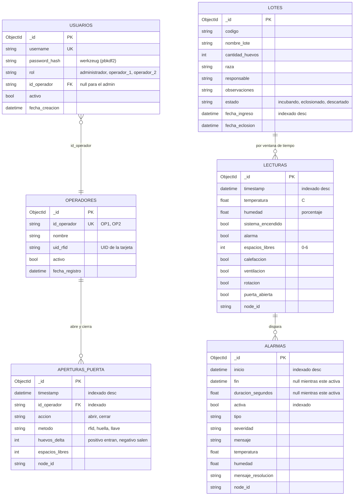

# SmartEgg — Modelo de datos

Base: **MongoDB**, base `smartegg`. Seis colecciones. Todas las fechas se
guardan en **UTC**.

La capa que las maneja es `Backend/src/db/` y es el **unico** modulo del backend
que habla con la base: API, lector serial, cliente MQTT y reportes pasan todos
por ahi.

---

## 1. Diagrama entidad-relacion



## 2. Las relaciones, y por que algunas son flojas

**OPERADORES → APERTURAS_PUERTA** es la unica relacion fuerte. Cada evento de
puerta guarda el `id_operador` que paso la tarjeta. Se guarda la **cadena**
(`"OP1"`), no el `ObjectId`, porque ese identificador viene del firmware, que no
sabe nada de la base: el Arduino manda `"OP1"` por el serial y el backend lo
persiste tal cual.

**USUARIOS → OPERADORES** enlaza la cuenta de la API con la persona fisica por
el mismo `id_operador`. El administrador lo tiene en `null` porque no abre la
incubadora. Es lo que hace que un operador solo vea sus propios informes.

**LOTES → LECTURAS es una relacion por tiempo, no por llave.** Las lecturas
**no** llevan `lote_id`, y no es un descuido: el nodo mide la incubadora, no
sabe que lote hay dentro. Para saber en que condiciones se incubo un lote se
cruza por la ventana entre su `fecha_ingreso` y su `fecha_eclosion` (o ahora, si
sigue incubando). Eso hace `estadisticas_por_lote()`, detras de
`GET /api/historico/lote/{id}`.

**LECTURAS → ALARMAS** tampoco guarda una llave. Una alarma se abre cuando una
lectura sale de rango y se cierra cuando vuelve a entrar; queda unida por el
intervalo `inicio`–`fin`, no por un `lectura_id`. Guardar la lectura que la
disparo diria poco: lo que importa es cuanto duro la condicion.

## 3. Indices

Declarados en un solo lugar, `src/db/connection.py`, y creados al conectar. Son
idempotentes: si ya existen, no pasa nada.

| Coleccion | Indice | Por que |
| :-- | :-- | :-- |
| `lecturas` | `timestamp` desc | La consulta que mas corre es "dame lo mas reciente" |
| `alarmas` | `inicio` desc, `timestamp` desc, `activa` | Historial y busqueda de la alarma abierta |
| `aperturas_puerta` | `timestamp` desc, `id_operador`, `(id_operador, timestamp)` | El compuesto sirve al reporte por operador, que filtra por los dos a la vez |
| `operadores` | `id_operador` **unico** | Impide dos operadores con el mismo id |
| `lotes` | `fecha_ingreso` desc, `estado` | Listado y conteo de lotes activos |
| `usuarios` | `username` **unico** | Impide dos cuentas con el mismo nombre |

Los descendentes no son capricho: con el indice en el mismo sentido que el
`sort`, Mongo lee el indice de corrido y no ordena en memoria.

## 4. Reglas que cumple toda la capa

**El historial es append-only.** Lecturas, alarmas y eventos de puerta no se
sobrescriben ni se borran. Una alarma no se "actualiza" cuando pasa: se cierra,
guardando su `fin` y su duracion.

**Sin base, nada revienta.** Con `MONGO_REQUIRED=false` el backend arranca
igual: sigue leyendo el serial y publicando por MQTT, solo deja de persistir, y
un hilo reintenta la conexion cada `MONGO_RECONNECT_DELAY` segundos. Cada metodo
devuelve su valor neutro (`None`, `[]`, `0` o el dict en cero) en vez de lanzar
excepcion. Los `POST` responden 503 y `GET /health` marca `base_datos: false`.

**Si la base se cae en marcha**, la primera escritura que falle con
`AutoReconnect` vuelve a modo degradado y relanza el hilo de reintento.

## 5. Las agregaciones

Viven en `repository.py` y son lo que alimenta los dashboards y los reportes.
Todas agrupan **en el motor**, no en Python:

| Metodo | Que hace | Quien lo usa |
| :-- | :-- | :-- |
| `estadisticas_rango` | min, max y promedio de temperatura y humedad | Informes, PDF |
| `serie_temporal` | Promedios por bloque de N minutos, con banda min-max | `GET /api/historico/series` |
| `resumen_diario` | Una fila por dia, cruzando lecturas con aperturas | `GET /api/historico/diario` |
| `conteo_alarmas_por_tipo` | Cuantas de cada tipo y cuanto duraron | `GET /api/historico/alarmas` |
| `resumen_puerta` | Aperturas, cierres y saldo de huevos, con desglose | `GET /api/puerta/resumen`, PDF |
| `actividad_por_operador` | Lo mismo ordenado por actividad | `GET /api/historico/operadores` |
| `estadisticas_por_lote` | Condiciones durante la incubacion de un lote | `GET /api/historico/lote/{id}` |

`serie_temporal` trunca cada marca de tiempo al inicio de su bloque con
aritmetica de milisegundos (`$subtract` + `$mod`), que es la forma de agrupar por
intervalos arbitrarios sin depender del operador `$dateTrunc`.

## 6. Nota sobre Mongo y los dashboards

Grafana **no tiene datasource gratuito para MongoDB**: el oficial es solo de la
version Enterprise. Por eso los dashboards historicos no leen la base
directamente, sino la API REST (`/api/historico/*`) a traves del plugin
Infinity, que si es libre.

Funciona y esta probado, pero conviene confirmarlo con el catedratico si el
enunciado pide explicitamente consultas SQL contra la base. La alternativa es
migrar a PostgreSQL, que si tiene datasource nativo; el costo seria reescribir
`src/db/` respetando los mismos nombres de metodo, sin tocar nada mas.

## 7. Respaldo

Antes de la defensa:

```bash
docker compose exec -T mongo mongodump --db=smartegg --archive > backup-$(date +%Y%m%d).archive
docker compose exec -T mongo mongorestore --archive --drop < backup-AAAAMMDD.archive
```

Los `.archive` no se suben al repositorio.
