# SmartEgg — Incubadora Inteligente IoT
## Proyecto 1

## Integrantes Grupo #12:

| Nombre | Carné |
| :--- | :--- |
| *Juan Manuel Ordóñez Sandoval* | *202400006* |
| *Héctor Alexander Pérez Natareno* | *202406223* |
| *Jhonatan José Acalón Ajanel* | *202401478* |
| *Jennifer Michelle Rosales Juárez* | *202400063* |
| *Diego Fernando Curtidor Sagui* | *202404402* |
| *Emily Maritza Tepeu Guacamaya* | *202402955* |

### My Key Contributions (Emily Tepeu):
* **Frontend Development & UI/UX:** Extended the existing React web application with a JWT-based authentication system, role-based access control (Admin/Operator), and new dedicated sections (operator profiles, admin panel), plus tablet-layout refinements.
* **Reports & Data Visualization:** Built the frontend interface to request and download PDF reports (general and per-operator) generated by the backend, and strengthened lot/item management forms with full client-side error validation.
* **DevOps & Documentation:** Containerized the frontend with Docker (Dockerfile + Nginx) and authored the full system's User Manual.
* 
---

## 1. Descripción de la Solución

La Facultad de Ciencias Agronómicas de la USAC solicitó el desarrollo de **SmartEgg**, una incubadora inteligente orientada a pequeños avicultores de la región quienes enfrentan pérdidas de entre el 30% y 40% en sus procesos de incubación por un control impreciso de temperatura y humedad, rotación manual inconsistente de los huevos, ausencia de monitoreo en tiempo real y falta de registros digitales del proceso.

El nodo físico del sistema es el componente embebido que se encarga de sensar el ambiente interno de la incubadora, controlar automáticamente sus actuadores, gestionar el acceso a la puerta y digitalizar esa información para que pueda ser consultada y almacenada por la plataforma web.

El nodo físico está construido sobre un microcontrolador Arduino Mega que:

- Lee temperatura y humedad mediante un sensor **DHT11**.
- Activa una fuente de calor cuando la temperatura cae por debajo del rango óptimo (37 °C) y un ventilador cuando la supera (38 °C).
- Rota automáticamente un servomotor cada 2 minutos (±45° respecto al centro) para simular el volteo periódico de los huevos, evitando que el embrión se adhiera a la cáscara.
- Detecta, mediante finales de carrera, cuántos espacios de la bandeja están disponibles para colocar más huevos.
- Controla el acceso a la puerta de la incubadora mediante un lector RFID y un servomotor dedicado a la cerradura: al pasar la tarjeta autorizada la puerta se destraba, y al pasarla nuevamente (una vez cerrada) se vuelve a trabar.
- Emite una alarma sonora con un buzzer ante condiciones críticas de temperatura o humedad.
- Muestra el estado del sistema en tiempo real en una pantalla LCD 16x2 y permite encender/apagar el sistema físicamente mediante un botón.
- Envía los datos recolectados a la computadora por comunicación serial (UART/USB) en formato JSON, donde el backend los recibe, los persiste en una base de datos y los expone mediante una API REST para que se muestren en el frontend web y permita gestionar los lotes de huevos y generar reportes en PDF.

---

## 2. Capas del Framework IoT
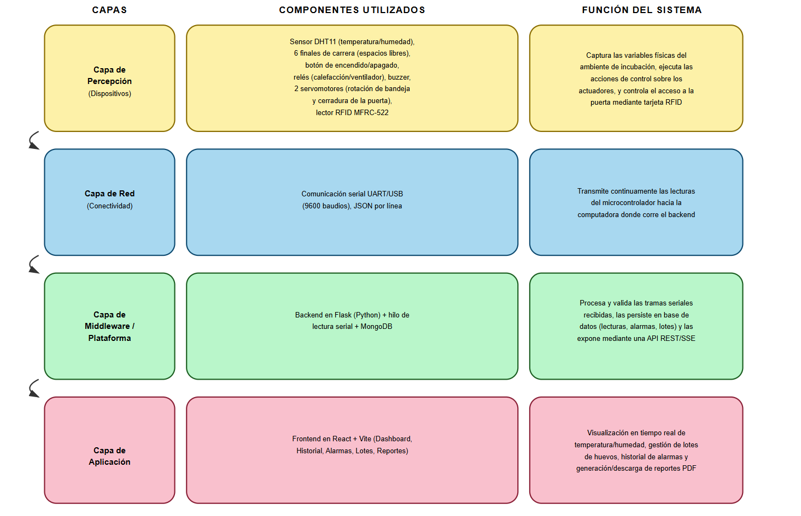

---

## 3. Stack Tecnológico

| Componente | Tecnología |
| :--- | :--- |
| Microcontrolador | Arduino Mega 2560 (ejecuta FreeRTOS para gestionar las tareas concurrentes) |
| Firmware | C++ sobre Arduino IDE |
| Librerías de firmware | `Arduino_FreeRTOS.h`, `task.h`, `semphr.h`, `DHT.h` (Adafruit DHT Sensor Library), `Servo.h`, `Wire.h`, `LiquidCrystal_I2C.h`, `SPI.h`, `MFRC522.h` |
| Backend | Python 3, Flask 3, Flask-CORS |
| Comunicación con el nodo físico | PySerial (lectura de puerto serial en un hilo dedicado) |
| Base de datos | MongoDB (vía PyMongo) |
| Generación de reportes | ReportLab (PDF) |
| Frontend | React 19 + Vite, Tailwind CSS 4, React Router, Recharts, Lucide Icons, React Hot Toast |
| Control de versiones | Git / GitHub |

---

## 4. Fotografías del Prototipo

### 4.1. Mockup del Prototipo
> Diseño previo del ensamblaje físico del prototipo, se muestra el boceto de lo que se pensaba realizar, tomando en cuenta las medidas de cada componente.


### 4.2. Molde de Huevos Impreso en 3D
> Pieza impresa en 3D diseñada para sostener los huevos dentro de la incubadora: es un molde circular con 6 orificios distribuidos a su alrededor donde se deben poner los huevos. Este molde va alineado con los 6 finales de carrera de la bandeja, de forma que cada orificio es funcional con los sensores y así al colocar o retirar un huevo de su orificio correspondiente, el final de carrera asociado cambia de estado y el sistema actualiza en tiempo real el conteo de espacios disponibles. Como tambien se imprimieron bisagras para el cierre y apertura de la puerta de la incubadora.
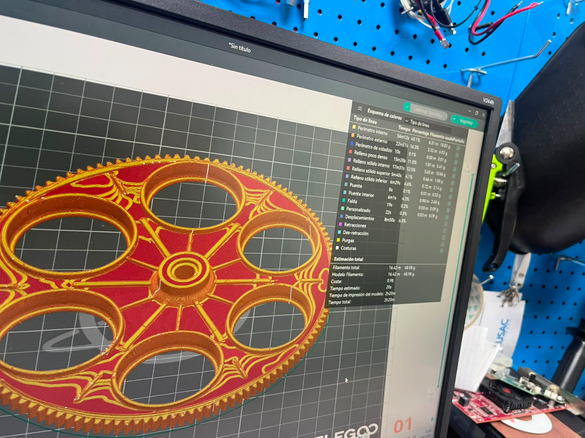

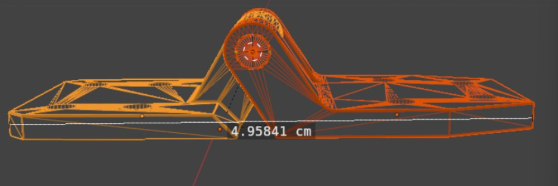


### 4.3. Prototipo Final
> Vista del circuito finalizado, encapsulado en una maqueta de dos niveles: el nivel inferior aloja el Arduino, los relés y todo el cableado (completamente cerrado, sin componentes expuestos, con únicamente el cable USB saliendo hacia la computadora), mientras que el nivel superior corresponde a la incubadora visible, con el molde de huevos impreso en 3D integrado en la parte superior.
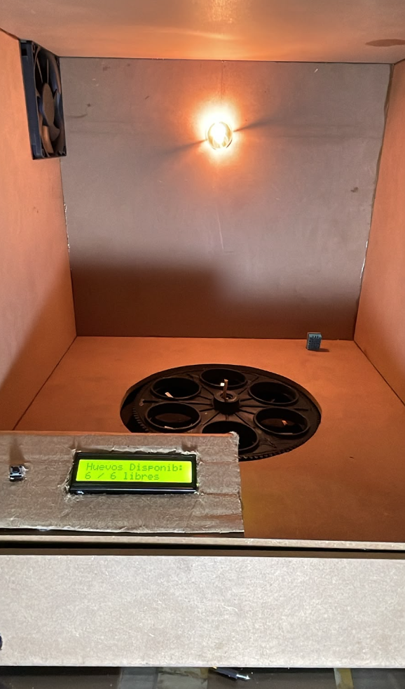

---

## 5. Mockups de la Aplicación Web / Móvil

> Diseños de la interfaz de usuario (UI/UX) para las pantallas principales del sistema previos a su implementación.

### Vista Principal
Pantalla con el estado del sistema (encendido/apagado), espacios libres, última lectura recibida, gráfica en vivo de temperatura y humedad, y aviso visual cuando hay una alarma activa.


### Vista de Historial y Alarmas
Pantalla con el listado histórico de lecturas de temperatura/humedad y el registro de alarmas generadas por condiciones críticas.
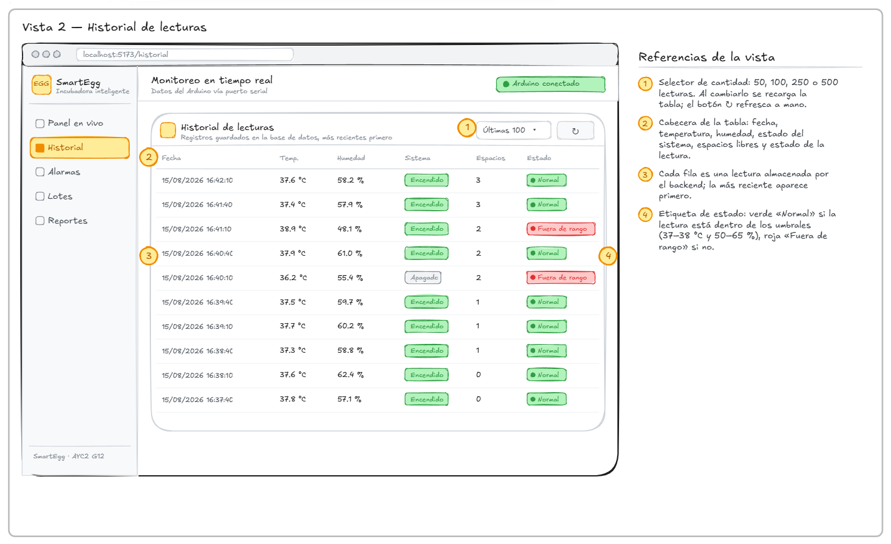
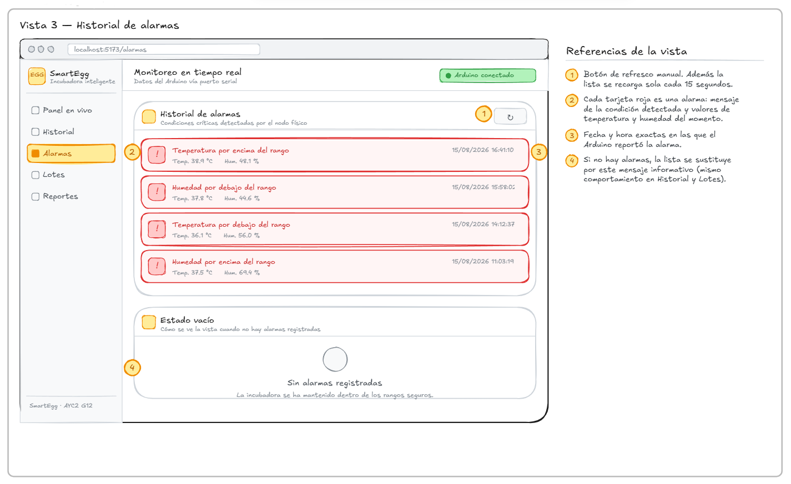

### Vista de Gestión de Lotes
Formulario y listado para registrar la ficha de identificación de cada lote de huevos ingresado a la incubadora (código, nombre del lote, cantidad de huevos, raza, responsable, estado y observaciones).
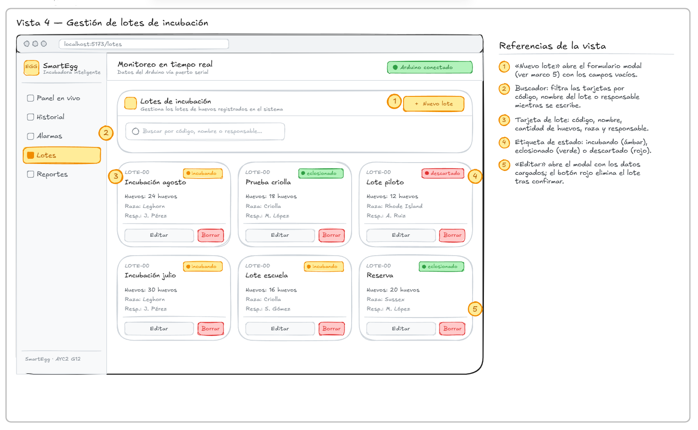

### Modal de Registro de Lote
Registra un nuevo lote de huevos o edita uno existente. Contiene el formulario con los campos de la ficha de identificación con validación de campos obligatorios antes de guardar.


### Vista de Reportes
Pantalla desde la cual se genera y descarga el reporte PDF del día.
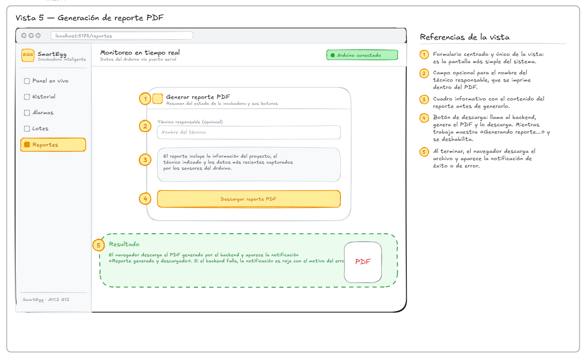

---

## 6. Diagrama de Conexiones

> Esquema electrónico del circuito diseñado en Wokwi, mostrando la conexión de cada componente al microcontrolador.
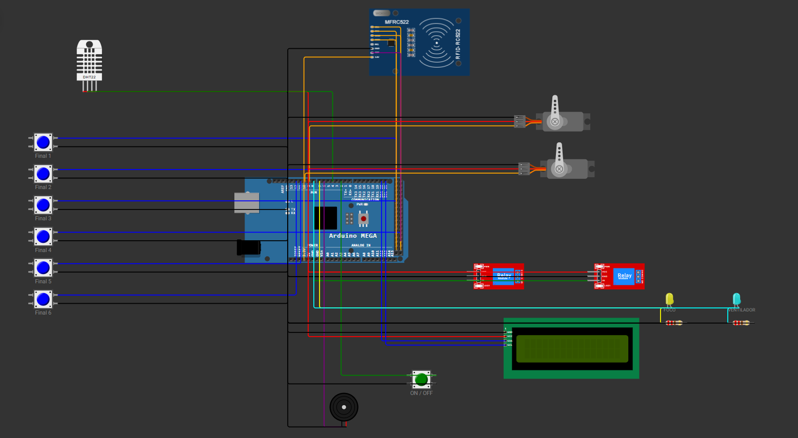

### Tabla de Pines y Conexiones

> Está implementado sobre un **Arduino Mega 2560**.

| Componente | Pin del Componente | Pin del Microcontrolador | Modo / Tipo de Señal |
| :--- | :--- | :--- | :--- |
| Sensor DHT11 | DATA | Pin digital 4 | Digital, un solo hilo (Input) |
| Relé — Calefacción/Luz | IN | Pin digital 7 | Digital (Output, activo en bajo) |
| Relé — Ventilador | IN | Pin digital 8 | Digital (Output, activo en bajo) |
| Buzzer (alarma) | + | Pin digital 6 | Digital (Output) |
| Botón encendido/apagado | Señal | Pin digital 2 | Digital (Input) |
| Servomotor (rotación de bandeja) | Señal (PWM) | Pin digital 9 | PWM (Output) |
| Final de carrera — Espacio 1 | Señal | Pin digital 44 | Digital (Input) |
| Final de carrera — Espacio 2 | Señal | Pin digital 45 | Digital (Input) |
| Final de carrera — Espacio 3 | Señal | Pin digital 46 | Digital (Input) |
| Final de carrera — Espacio 4 | Señal | Pin digital 47 | Digital (Input) |
| Final de carrera — Espacio 5 | Señal | Pin digital 11 | Digital (Input) |
| Final de carrera — Espacio 6 | Señal | Pin digital 12 | Digital (Input) |
| Pantalla LCD 16x2 (módulo I2C) | SDA / SCL | Bus I2C (dirección `0x27`) | I2C (Output) |
| Módulo RFID MFRC-522 — SS/SDA | SDA | Pin digital 53 | SPI (Output, chip select) |
| Módulo RFID MFRC-522 — RST | RST | Pin digital 49 | Digital (Output) |
| Módulo RFID MFRC-522 — SCK/MOSI/MISO | SCK / MOSI / MISO | Pines 52 / 51 / 50 | SPI de hardware (fijo en el Mega) |
| Servomotor de la cerradura | Señal (PWM) | Pin digital 10 | PWM (Output) |

---

## 7. Control de Acceso a la Puerta

Para que solo personal autorizado pueda abrir y cerrar la incubadora, el acceso se controla mediante una tarjeta RFID en lugar de un cerrojo manual.

**Hardware:**
* Lector RFID **MFRC-522** (13.56 MHz), conectado por SPI de hardware (pines 50/51/52 fijos en el Mega) más SS en el pin 53 y RST en el pin 49.
* Servomotor dedicado a la cerradura (pin 10, independiente del servomotor de rotación de la bandeja).
* Alimentación del módulo RFID desde el pin 3.3V del Mega, con conversor de nivel lógico en las líneas SCK/MOSI/SDA/RST (el módulo no tolera 5V).

**Lógica de funcionamiento:**

1. Cerradura inicia **trabada** (servo en 0°).
2. Se pasa la tarjeta autorizada - el servo sube a 90° (**destrabada**) - se registra `espacios_libres` en ese momento - se emite el evento `"abrir"`.
3. Se abre/cierra la puerta manualmente las veces que sea necesario para ingresar o retirar huevos.
4. Se pasa la misma tarjeta otra vez - el servo baja a 0° (**trabada**) - se calcula `huevos_delta` comparando `espacios_libres` contra el paso 2 - se emite el evento `"cerrar"`.
5. Si la tarjeta leída no coincide con la registrada, se emite `"tarjeta_no_registrada"` con su UID, para poder darla de alta en el firmware.

---

## 8. Diagrama de Arquitectura de Software

> Diagrama de bloques que muestra el flujo de datos desde el firmware, pasando por el backend, hasta la base de datos y el cliente web.

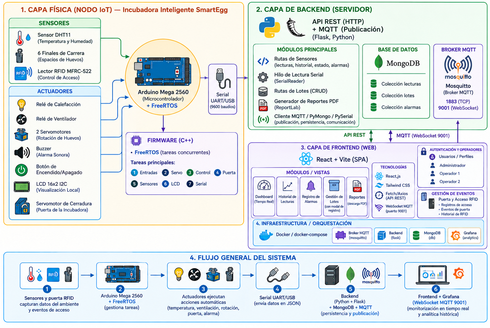

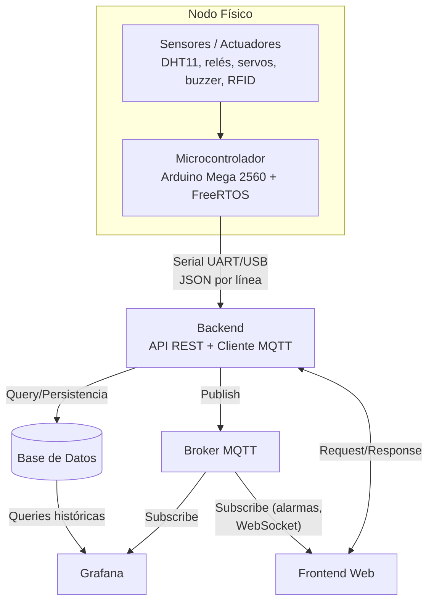
```mermaid
flowchart TD
    subgraph NodoFisico["Nodo Físico"]
        SENS["Sensores / Actuadores<br/>DHT11, relés, servos, buzzer, RFID"]
        MCU["Microcontrolador<br/>Arduino Mega 2560 + FreeRTOS"]
        SENS --> MCU
    end

    MCU -- "Serial UART/USB<br/>JSON por línea" --> BACK["Backend<br/>API REST + Cliente MQTT"]
    BACK -- "Query/Persistencia" --> DB[("Base de Datos")]
    BACK <-- "Request/Response" --> FRONT["Frontend Web"]
    BACK -- "Publish" --> BROKER["Broker MQTT"]
    BROKER -- "Subscribe" --> GRAF["Grafana"]
    BROKER -- "Subscribe (alarmas,<br/>WebSocket)" --> FRONT
    DB -- "Queries históricas" --> GRAF
```

**Flujo general de datos:**

1. El **firmware** (Arduino, C++) lee sensores, controla los actuadores y el acceso a la puerta en un ciclo continuo, y cada segundo imprime por el puerto serial una línea JSON con el estado actual del sistema (temperatura, humedad, estado del sistema, alarma, espacios libres, estado de la puerta) y, cuando corresponde, una línea adicional con el evento de puerta.
2. El **backend** (Flask) mantiene un hilo dedicado `SerialReader` que escucha el puerto serial de forma continua e interpreta cada línea JSON.
3. Cada lectura válida se guarda en la **base de datos** (colección/tabla `lecturas`) y, si representa una transición a estado de alarma, se registra en `alarmas`; los eventos de puerta se registran junto con el operador, el método de acceso y los huevos ingresados/retirados.
4. El backend expone esta información mediante una **API REST**, publica la telemetría y los eventos hacia un **broker MQTT**, y ofrece un endpoint para generar reportes en **PDF**.
5. El **frontend** (React) consume los datos en tiempo real para el Dashboard, se suscribe al broker para recibir alarmas sin recargar la página, consulta el historial mediante REST, y permite gestionar los lotes de huevos y descargar los reportes.
6. **Grafana** se conecta tanto al broker (paneles en tiempo real) como a la base de datos (paneles de analítica histórica).

---

## 9. Multitarea con FreeRTOS

### Explicación de la Implementación

Para este sistema se optó por **FreeRTOS** (`Arduino_FreeRTOS.h`), el firmware crea **7 tareas** en `setup()` mediante `xTaskCreate()`, cada una con su propio periodo fijo (controlado con `vTaskDelayUntil()`, que evita el desfase acumulado tipico de usar `delay()`) y su propia prioridad, de forma que las tareas más sensibles al tiempo (entradas digitales, servomotor y puerta) se ejecutan con mayor frecuencia y prioridad que las tareas de reporte (LCD, serial).

Ya que varias tareas necesitan leer y escribir el mismo estado del sistema (temperatura, humedad, si está encendido, si hay alarma, espacios libres, estado de la puerta), se centralizó ese estado en un módulo aparte (`estado_compartido.h/cpp`) protegido por un **mutex** (`xSemaphoreCreateMutex`). Cada acceso de lectura o escritura toma el mutex (`xSemaphoreTake`) antes de tocar la estructura y lo libera (`xSemaphoreGive`) justo después, evitando condiciones de carrera entre tareas que corren de forma concurrente.

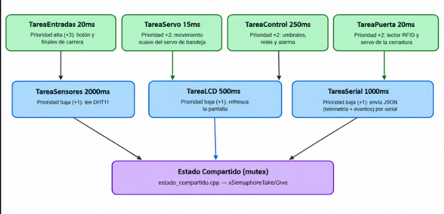

### Tareas Implementadas

| Tarea | Prioridad | Periodo | Descripción |
| :--- | :--- | :--- | :--- |
| `TareaEntradas` | `tskIDLE_PRIORITY + 3` (alta) | 20 ms | Sondea el botón de encendido/apagado y los 6 finales de carrera; actualiza el estado compartido |
| `TareaServo` | `tskIDLE_PRIORITY + 2` | 15 ms | Avanza el servomotor 1° hacia su ángulo objetivo (movimiento suave) y evalúa si toca alternar de posición (cada 2 minutos) |
| `TareaControl` | `tskIDLE_PRIORITY + 2` | 250 ms | Evalúa los umbrales de temperatura/humedad y controla los relés (calefacción/ventilador) y la alarma, apaga todo si el sistema está en OFF |
| `TareaPuerta` | `tskIDLE_PRIORITY + 2` | 20 ms | Avanza el servomotor de la cerradura de forma no bloqueante y revisa si hay una tarjeta RFID nueva sobre el lector, para trabar/destrabar y notificar el evento correspondiente |
| `TareaSensores` | `tskIDLE_PRIORITY + 1` | 2000 ms | Lee el sensor DHT11 y actualiza el estado compartido |
| `TareaLCD` | `tskIDLE_PRIORITY + 1` | 500 ms | Refresca la pantalla LCD con el estado actual del sistema |
| `TareaSerial` | `tskIDLE_PRIORITY + 1` | 1000 ms | Envía por el puerto serial la línea JSON con la telemetría y, si corresponde, la línea del evento de puerta |

### Snippet de Código

```cpp
// Creación de tareas (main.ino)
crearTarea(TareaEntradas, "Entradas", STACK_ENTRADAS, PRIO_ENTRADAS);
crearTarea(TareaSensores, "Sensores", STACK_SENSORES, PRIO_SENSORES);
crearTarea(TareaControl,  "Control",  STACK_CONTROL,  PRIO_CONTROL);
crearTarea(TareaServo,    "Servo",    STACK_SERVO,    PRIO_SERVO);
crearTarea(TareaLCD,      "LCD",      STACK_LCD,      PRIO_LCD);
crearTarea(TareaSerial,   "Serial",   STACK_SERIAL,   PRIO_SERIAL);
crearTarea(TareaPuerta,   "Puerta",   STACK_PUERTA,   PRIO_PUERTA);

vTaskStartScheduler();

// Ejemplo de tarea periódica no bloqueante
static void TareaSensores(void *pvParameters) {
    TickType_t ultimaEjecucion = xTaskGetTickCount();
    for (;;) {
        LecturaSensor lectura = sensors_leer();
        if (lectura.valida) {
            estadoSetLectura(lectura);
        }
        vTaskDelayUntil(&ultimaEjecucion, PERIODO_SENSORES);
    }
}

// Acceso protegido por mutex (estado_compartido.cpp)
void estadoSetLectura(const LecturaSensor &lectura) {
    xSemaphoreTake(estadoMutex, portMAX_DELAY);
    estado.temperatura   = lectura.temperatura;
    estado.humedad       = lectura.humedad;
    estado.lecturaValida = lectura.valida;
    xSemaphoreGive(estadoMutex);
}
```

---

## 10. API Contracts

### 10.1. Protocolo Serial (Firmware → Backend)

* **Puerto:** configurable `SERIAL_PORT`, con autodetección opcional si el puerto configurado no está disponible.
* **Velocidad:** 9600 baudios.
* **Frecuencia de envío:** 1 línea de telemetría por segundo, más una línea adicional de evento cuando corresponde (ver abajo).

**Línea de telemetría (cada segundo):**

```json
{"temperatura":37.5,"humedad":55.0,"sistema_encendido":1,"alarma":0,"espacios_libres":4,"puerta_abierta":0,"id_operador_actual":null}
```

| Campo | Tipo | Descripción |
| :--- | :--- | :--- |
| `temperatura` | float | Última lectura de temperatura (°C) |
| `humedad` | float | Última lectura de humedad relativa (%) |
| `sistema_encendido` | 0/1 | Estado del botón físico de encendido/apagado |
| `alarma` | 0/1 | Si hay una condición crítica activa |
| `espacios_libres` | int | Espacios de la bandeja sin huevo (0-6) |
| `puerta_abierta` | 0/1 | Estado actual de la cerradura: 1 = destrabada, 0 = trabada |
| `id_operador_actual` | string \| null | Operador que destrabó la puerta actualmente, o `null` si está trabada |

**Línea de evento (solo cuando ocurre, inmediatamente después de la telemetría del mismo ciclo):**

```json
{"evento":"puerta","accion":"abrir","id_operador":"OP1","metodo":"rfid"}
{"evento":"puerta","accion":"cerrar","id_operador":"OP1","metodo":"rfid","huevos_delta":-2}
{"evento":"tarjeta_no_registrada","uid":"04A35B2C"}
```

| Campo | Descripción |
| :--- | :--- |
| `evento` | `"puerta"` (acción sobre la cerradura) o `"tarjeta_no_registrada"` (tarjeta leída que no coincide con la registrada) |
| `accion` | `"abrir"` (primera pasada de tarjeta, destraba) o `"cerrar"` (segunda pasada, traba) — solo si `evento == "puerta"` |
| `id_operador` | Identificador de la tarjeta que generó el evento |
| `metodo` | Método de acceso usado, `"rfid"` |
| `huevos_delta` | Solo en `accion == "cerrar"`. Positivo = se ocuparon más espacios (huevos ingresados); negativo = se liberaron espacios (huevos retirados). Se calcula comparando `espacios_libres` al destrabar vs. al volver a trabar |
| `uid` | Solo en `evento == "tarjeta_no_registrada"`. UID de la tarjeta leída en hexadecimal, para poder registrarla en el firmware |

### 10.2. API REST (Backend)

**URL base:** `http://localhost:5000` (configurable mediante `FLASK_HOST` / `FLASK_PORT`). Detrás del proxy, toda la API cuelga de `http://localhost:8080/api`.

El contrato completo está **publicado en Swagger/OpenAPI**, generado desde el propio backend, con las 37 rutas de la API:

| Recurso | URL |
| :--- | :--- |
| Swagger UI (navegable) | `http://localhost:8080/api/docs` |
| Especificación OpenAPI | `http://localhost:8080/api/openapi.json` · `/api/openapi.yaml` |

La tabla de abajo resume los endpoints principales; Swagger es la referencia exacta de parámetros, respuestas y códigos de estado.

#### Sensores

| Método | Endpoint | Descripción |
| :--- | :--- | :--- |
| `GET` | `/api/sensores/actual` | Devuelve la última lectura recibida del nodo físico |
| `GET` | `/api/sensores/historial?limit=100` | Devuelve el historial de lecturas almacenadas (máximo 1000) |
| `GET` | `/api/sensores/estado` | Devuelve el estado de la conexión serial y qué sensores/actuadores están activos |
| `GET` | `/api/sensores/alarmas?limit=50` | Devuelve las alarmas más recientes (máximo 500) |
| `GET` | `/api/sensores/stream` | Stream en tiempo real (Server-Sent Events) con cada nueva lectura recibida |

**Ejemplo — `GET /api/sensores/actual`**
```json
{
  "id": "66c1f10a1b2c3d4e5f60001",
  "temperatura": 37.5,
  "humedad": 55.0,
  "sistema_encendido": true,
  "alarma": false,
  "espacios_libres": 4,
  "timestamp": "2026-08-14T15:32:10.512000+00:00"
}
```

#### Autenticación y Operadores

| Método | Endpoint | Descripción |
| :--- | :--- | :--- |
| `POST` | `/api/auth/login` | Autentica a un usuario (administrador u operador) y devuelve un token junto con su rol |
| `GET` | `/api/operadores` | Lista los operadores registrados (solo administrador) |
| `POST` | `/api/operadores` | Registra un nuevo operador (nombre, id, edad, género) |
| `GET` | `/api/operadores/<id>/eventos` | Devuelve los eventos de puerta y diagnósticos asociados a un operador específico |

**Cuerpo de la petición — `POST /api/auth/login`**
```json
{
  "usuario": "admin",
  "password": "********"
}
```

**Respuesta exitosa**
```json
{
  "token": "eyJhbGciOiJIUzI1NiIs...",
  "rol": "administrador"
}
```

#### Eventos de Puerta

| Método | Endpoint | Descripción |
| :--- | :--- | :--- |
| `GET` | `/api/puerta/eventos?limit=50` | Devuelve el historial de aperturas/cierres de la puerta, con operador, método de acceso y huevos ingresados/retirados |

#### Lotes de Huevos

| Método | Endpoint | Descripción |
| :--- | :--- | :--- |
| `POST` | `/api/lotes` | Crea un nuevo lote (ficha de identificación de huevos ingresados) |
| `GET` | `/api/lotes` | Lista todos los lotes registrados |
| `GET` | `/api/lotes/<id>` | Obtiene un lote específico por su id |
| `PUT` | `/api/lotes/<id>` | Actualiza campos de un lote existente |
| `DELETE` | `/api/lotes/<id>` | Elimina un lote |

**Cuerpo de la petición — `POST /api/lotes`**
```json
{
  "codigo": "LOTE-001",
  "nombre_lote": "Incubación agosto",
  "cantidad_huevos": 24,
  "raza": "Leghorn",
  "responsable": "Nombre del responsable",
  "estado": "incubando",
  "observaciones": "Notas adicionales..."
}
```
* `codigo`, `nombre_lote` y `cantidad_huevos` son obligatorios
* `estado` acepta: `incubando`, `eclosionado` o `descartado`

**Respuesta exitosa (201 Created)**
```json
{
  "id": "66c1f10a1b2c3d4e5f60009",
  "codigo": "LOTE-001",
  "nombre_lote": "Incubación agosto",
  "cantidad_huevos": 24,
  "raza": "Leghorn",
  "responsable": "Nombre del responsable",
  "observaciones": "Notas adicionales...",
  "estado": "incubando",
  "fecha_ingreso": "2026-08-14T15:40:00.000000+00:00"
}
```

#### Reportes

| Método | Endpoint | Descripción |
| :--- | :--- | :--- |
| `GET` | `/api/reportes/pdf?tecnico=Nombre` | Genera y descarga el reporte PDF del día, el cual incluye el técnico responsable, resumen de lotes actuales, temperaturas/humedad máx-mín del día y registro de alarmas |

---

## 11. Broker MQTT

> El broker MQTT centraliza la distribución de la telemetría y los eventos en tiempo real hacia Grafana y el frontend, evitando que estos deban consultar constantemente al backend.

Se utiliza **Mosquitto** como broker, con dos listeners configurados:
- Puerto **1883** para conexiones MQTT estándar (backend, Grafana).
- Puerto **9001** con soporte WebSocket, necesario para que el frontend se suscriba directamente desde el navegador.

### 11.1. Jerarquía de Topics

| Topic | Publicador | Suscriptor(es) | QoS | Retained | Descripción |
| :--- | :--- | :--- | :--- | :--- | :--- |
| `smartegg/{id}/sensores/lectura` | Backend | Grafana | 0 | Sí | Telemetría completa del nodo en un solo JSON |
| `smartegg/{id}/sensores/temperatura` | Backend | Grafana | 0 | Sí | Última lectura de temperatura |
| `smartegg/{id}/sensores/humedad` | Backend | Grafana | 0 | Sí | Última lectura de humedad |
| `smartegg/{id}/actuadores/estado` | Backend | Grafana, Frontend | 1 | Sí | Estado de calefacción, ventilación y rotación |
| `smartegg/{id}/puerta/evento` | Backend | Frontend | 1 | No | Eventos de apertura/cierre de la puerta (operador, método, huevos_delta) |
| `smartegg/{id}/alarmas/critica` | Backend | Frontend | 1 | Sí | Alarma ante condición crítica de temperatura/humedad |
| `smartegg/{id}/status` | Backend (LWT) | Frontend, Grafana | 1 | Sí | Disponibilidad del nodo (`online` / `offline`) |

El `{id}` identifica el nodo físico, lo que permite escalar el diseño a múltiples incubadoras sin cambiar la estructura de los topics.

**Formato del payload** (JSON, común a los topics de telemetría):
```json
{
  "temperatura": 37.5,
  "humedad": 55.0,
  "timestamp": "2026-08-14T15:32:10.512000+00:00"
}
```

### 11.2. Last Will and Testament

El backend se conecta al broker declarando un mensaje LWT sobre `smartegg/{id}/status` con el payload `"offline"`. Si la conexión se pierde de forma inesperada (caída del proceso, corte del puerto serial, etc.), el broker publica automáticamente ese mensaje, permitiendo que Grafana y el frontend detecten la desconexión sin depender de un timeout manual. Al conectarse correctamente, el backend publica `"online"` como mensaje retained en el mismo topic.

### 11.3. Manejo de Errores y Reconexión

Tanto la lectura serial como la conexión al broker cuentan con lógica de reintento: si el puerto serial se desconecta, se intenta reabrir cada pocos segundos sin detener el proceso; si la conexión MQTT se cae, el cliente reintenta la conexión automáticamente y vuelve a publicar el último estado retenido una vez reconectado. Estos eventos quedan registrados en el log del backend.


### 11.4. Evidencia con un Cliente MQTT de Prueba

La publicación se verificó con **MQTTX** conectado al broker en `localhost:11883`
(el puerto 1883 del contenedor publicado en el anfitrión) y suscrito al comodín
`smartegg/#`, que abarca todos los topics del nodo.

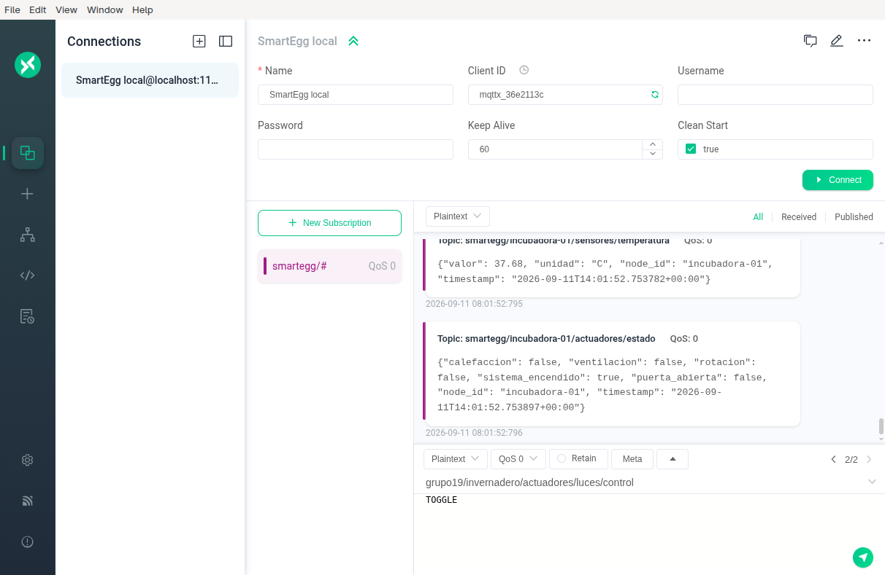

En la captura se ven los mensajes llegando en `smartegg/incubadora-01/sensores/temperatura`
y `smartegg/incubadora-01/actuadores/estado`, con su payload JSON y el QoS de cada uno.

La misma comprobación desde la terminal, sin cliente gráfico:

```bash
mosquitto_sub -h localhost -p 11883 -t 'smartegg/#' -v
```


---

## 12. Base de Datos

> Conserva el historial completo de lecturas, alarmas, lotes de huevos, operadores y eventos de puerta, y es la fuente de los paneles de analítica histórica en Grafana.

**Sobre el motor.** La persistencia se implementó sobre **MongoDB**, un motor documental en lugar de uno relacional, con la autorización correspondiente para este proyecto. El diseño entidad-relación no se abandonó: cada entidad del modelo es una colección, las relaciones se mantienen por referencia (`_id` de Mongo e `id_operador` de negocio) y las agregaciones que alimentan los paneles históricos —mínimos, máximos, promedios, conteos por operador y duración de alarmas— se resuelven con el *aggregation framework*, equivalente a los `GROUP BY` de SQL. Las colecciones de lecturas, alarmas y aperturas son **append-only**: nunca se sobrescribe un documento previo.

### 12.1. Modelo Entidad-Relación

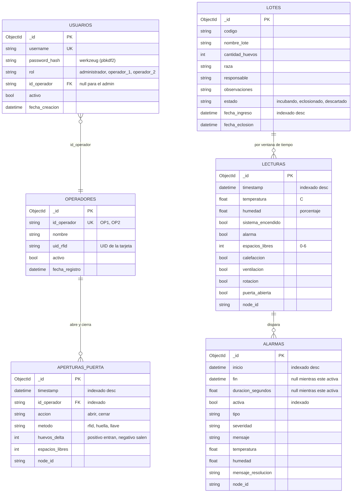
```mermaid
erDiagram
    OPERADORES ||--o{ APERTURAS_PUERTA : "abre y cierra"
    USUARIOS   }o--|| OPERADORES       : "id_operador"
    LOTES      ||--o{ LECTURAS         : "por ventana de tiempo"
    LECTURAS   ||--o{ ALARMAS          : "dispara"

    OPERADORES {
        ObjectId _id PK
        string   id_operador UK "OP1, OP2"
        string   nombre
        string   uid_rfid "UID de la tarjeta"
        bool     activo
        datetime fecha_registro
    }

    USUARIOS {
        ObjectId _id PK
        string   username UK
        string   password_hash "werkzeug (pbkdf2)"
        string   rol "administrador, operador_1, operador_2"
        string   id_operador FK "null para el admin"
        bool     activo
        datetime fecha_creacion
    }

    LECTURAS {
        ObjectId _id PK
        datetime timestamp "indexado desc"
        float    temperatura "C"
        float    humedad "porcentaje"
        bool     sistema_encendido
        bool     alarma
        int      espacios_libres "0-6"
        bool     calefaccion
        bool     ventilacion
        bool     rotacion
        bool     puerta_abierta
        string   node_id
    }

    ALARMAS {
        ObjectId _id PK
        datetime inicio "indexado desc"
        datetime fin "null mientras este activa"
        float    duracion_segundos "null mientras este activa"
        bool     activa "indexado"
        string   tipo
        string   severidad
        string   mensaje
        float    temperatura
        float    humedad
        string   mensaje_resolucion
        string   node_id
    }

    APERTURAS_PUERTA {
        ObjectId _id PK
        datetime timestamp "indexado desc"
        string   id_operador FK "indexado"
        string   accion "abrir, cerrar"
        string   metodo "rfid, huella, llave"
        int      huevos_delta "positivo entran, negativo salen"
        int      espacios_libres
        string   node_id
    }

    LOTES {
        ObjectId _id PK
        string   codigo
        string   nombre_lote
        int      cantidad_huevos
        string   raza
        string   responsable
        string   observaciones
        string   estado "incubando, eclosionado, descartado"
        datetime fecha_ingreso "indexado desc"
        datetime fecha_eclosion
    }
```
**Entidades principales:**

| Entidad | Descripción |
| :--- | :--- |
| `lecturas` | Historial de temperatura, humedad y espacios disponibles, con marca de tiempo |
| `alarmas` | Registro de condiciones críticas: tipo, severidad, timestamp de inicio y de resolución |
| `lotes_huevos` | Ficha de identificación del lote/huevo ingresado, fecha de ingreso y nodo asociado |
| `operadores` | Nombre, identificador, edad y género de cada operador autorizado |
| `aperturas_puerta` | Día, hora, operador, tipo de acción (abrir/cerrar), método de acceso y huevos ingresados/retirados |

### 12.2. Consultas Históricas

Sobre estas tablas se construyen las consultas que alimentan los paneles históricos de Grafana:
- Mínimo, máximo y promedio de temperatura/humedad por rango de tiempo (última hora, 24 horas, última semana).
- Tendencia de temperatura y humedad a lo largo del tiempo.
- Duración de cada alarma (diferencia entre el timestamp de inicio y el de resolución).
- Cantidad de veces que se abrió y se cerró la puerta, agrupado por operador y por día.

---

## 13. Autenticación y Perfiles de Usuario

> El frontend distingue entre un perfil de **administrador** y los perfiles de **Operador 1** y **Operador 2**, de forma que cada operador consulta únicamente su propia actividad y el administrador tiene visibilidad completa del sistema.

- **Administrador:** acceso a todas las vistas descritas en la sección 5 (Dashboard, Historial, Alarmas, Lotes, Reportes), sin restricciones.
- **Operador 1 / Operador 2:** acceso a un perfil propio donde consulta únicamente los eventos de puerta y diagnósticos asociados a su tarjeta RFID (`id_operador`), además de las vistas generales de Dashboard e Historial.

El inicio de sesión valida las credenciales contra el backend (`POST /api/auth/login`) y determina qué rutas y datos se muestran según el rol devuelto. La interfaz es responsiva y se adapta correctamente a dispositivos móviles y tablets.

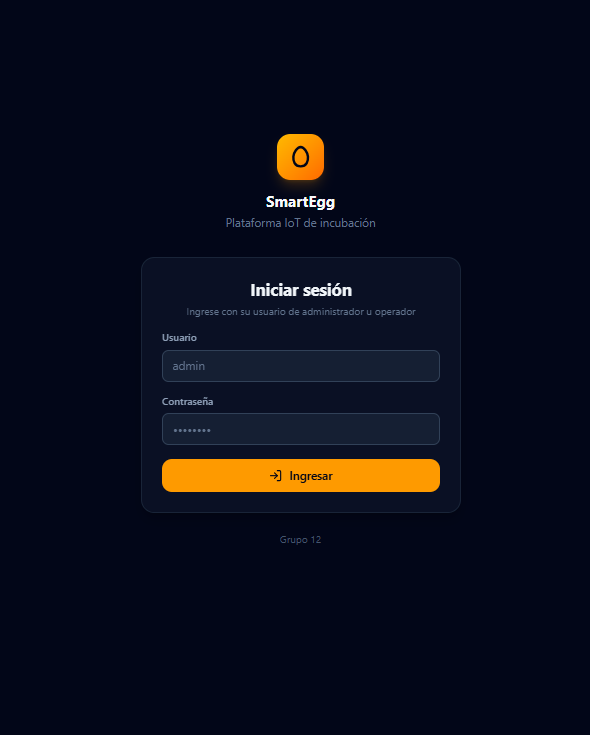

---

## 14. Grafana: Monitoreo en Tiempo Real y Analítica Histórica

Grafana centraliza la observabilidad del sistema combinando dos fuentes de datos claramente diferenciadas.

### 14.1. Paneles en Tiempo Real (fuente: broker MQTT)
- Temperatura y humedad actuales, actualizadas en vivo conforme se publican en el broker.
- Estado actual de los actuadores (calefacción, ventilación, rotación).
- Indicador de disponibilidad del nodo (online/offline), basado en el topic `smartegg/{id}/status`.

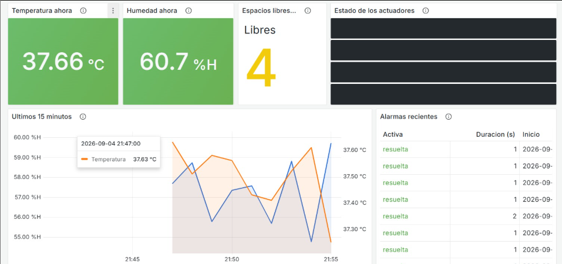
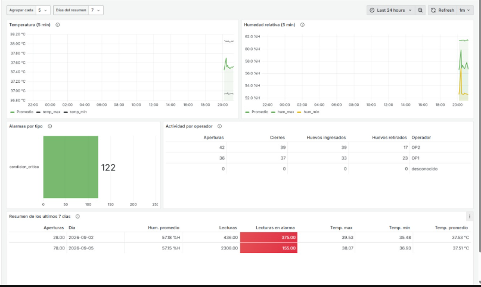


### 14.2. Paneles Históricos (fuente: base de datos)
- Tendencia de temperatura y humedad en rangos de tiempo seleccionables.
- Mínimo, máximo y promedio de temperatura/humedad por lote registrado.
- Historial de alarmas, incluyendo la duración de cada condición crítica.
- Cantidad de veces que se abrió y se cerró la puerta.

---

## 15. Visualización Avanzada de Datos

> Dos piezas distintas y con propósitos distintos: una librería de gráficos para la serie temporal y una escena 3D interactiva para el estado del nodo. Ninguna de las dos usa datos simulados: ambas se alimentan del mismo flujo que llega del Arduino por el puerto serial.

### 15.1. Framework de gráficos: Recharts

Se eligió **Recharts** para las gráficas de temperatura y humedad del dashboard (`Frontend/src/components/dashboard/LiveChart.jsx`).

**Por qué Recharts y no otra:**

| Criterio | Recharts | Chart.js | D3.js |
| :--- | :--- | :--- | :--- |
| Integración con React | Componentes React nativos (`<AreaChart>`, `<Line>`); el gráfico se redibuja solo cuando cambia el estado | Requiere un wrapper y manejar el ciclo de vida del canvas a mano | Manipula el DOM por su cuenta, lo que choca con el DOM virtual de React |
| Curva de aprendizaje | Baja: es JSX, se compone como cualquier otro componente | Media: API imperativa y objeto de configuración extenso | Alta: hay que construir escalas, ejes y transiciones a mano |
| Tipos de gráfico | Línea, área, barras, radial, dispersión, compuestos de doble eje | Amplio catálogo sobre canvas | Ilimitado, pero todo se programa |
| Rendimiento con series cortas | Suficiente: el dashboard mantiene una ventana acotada de puntos en memoria | Mejor en series muy largas (canvas) | Depende de la implementación |

El proyecto necesita **un gráfico de doble eje (temperatura y humedad) que se actualice en vivo dentro de una SPA de React**, no un catálogo enorme de tipos de gráfico ni renderizado de decenas de miles de puntos. Recharts cubre exactamente ese caso con la menor cantidad de código y sin salirse del modelo declarativo de React; D3 daría un control que aquí no se aprovecha y Chart.js obligaría a sincronizar a mano el canvas con el estado.

**De dónde salen los datos:** el hook `useSensorStream` (`Frontend/src/hooks/useSensorStream.js`) se suscribe al stream **SSE** `/api/sensores/stream` del backend, que reemite cada lectura que el backend acaba de recibir del Arduino por el puerto serial. Ese hook mantiene una ventana de las últimas lecturas y se la pasa a `<LiveChart history={history} />`. Si el stream se cae, el mismo hook cubre el hueco consultando `/api/sensores/actual` por REST hasta que el stream vuelve.

### 15.2. Visualización interactiva 3D: Three.js

La escena 3D (`Frontend/src/viz/`) está construida con **Three.js** mediante `@react-three/fiber` y `@react-three/drei`, y representa la incubadora real en el dashboard:

| Elemento de la escena | Qué dato real representa |
| :--- | :--- |
| Color de la luz que baña el modelo | La **temperatura** medida por el DHT11: verde dentro del rango 37–38 °C, y se interpola hacia azul o hacia rojo a medida que la lectura se aleja por debajo o por encima del rango |
| Giro de la bandeja sobre su eje | El estado real de **rotación** del servomotor: mientras el nodo reporta rotación activa, la bandeja bascula hacia el ángulo objetivo |
| Huevos dibujados en la bandeja | Los **espacios ocupados** según los finales de carrera: se dibuja un huevo por cada espacio ocupado de los seis |
| Cámara orbital | Interacción del usuario: se puede orbitar, acercar y alejar la incubadora con el mouse (`OrbitControls`) |

Los tres valores (`temperatura`, `rotacionActiva`, `espaciosLibres`) provienen de la misma lectura real que alimenta las gráficas, no de valores generados en el navegador.

### 15.3. Video demostrativo

Video de 2 a 4 minutos mostrando la escena 3D y las gráficas reaccionando a los datos del nodo en tiempo real.

**Enlace al video:** _pendiente de publicar — reemplazar esta línea por la URL._

---

## 16. Orquestación con Docker

Toda la plataforma se levanta mediante un único **`docker-compose.yml`**, con al menos los siguientes servicios:

| Servicio | Descripción |
| :--- | :--- |
| `mosquitto` | Broker MQTT, con los listeners 1883 (MQTT) y 9001 (WebSocket) |
| `backend` | API REST + cliente MQTT + lector serial |
| `mongo` | Base de datos, con un volumen para persistir el historial entre reinicios |
| `grafana` | Dashboards, con un volumen para conservar la configuración y los paneles provisionados |
| `frontend` | La SPA compilada, servida por Nginx |
| `caddy` | Proxy inverso: publica frontend, API, WebSocket del broker y Grafana en un único puerto (8080) |

Cada servicio corre en su propio contenedor, comunicándose a través de una red Docker definida en el mismo compose. Las credenciales, puertos y URLs de conexión entre servicios se externalizan mediante variables de entorno en un archivo `.env`, a partir de la plantilla `.env.example` del repositorio.

Para levantar toda la plataforma:
```bash
docker compose up -d
```

**Evidencia de los contenedores en ejecución:**

```
NAME                 SERVICE     STATUS                   PORTS
smartegg-backend     backend     Up 4 minutes (healthy)   0.0.0.0:5000->5000/tcp
smartegg-caddy       caddy       Up 4 minutes (healthy)   443/tcp, 2019/tcp, 0.0.0.0:8080->80/tcp
smartegg-frontend    frontend    Up 4 minutes (healthy)   0.0.0.0:5173->80/tcp
smartegg-grafana     grafana     Up 4 minutes             0.0.0.0:3000->3000/tcp
smartegg-mongo       mongo       Up 5 minutes (healthy)   0.0.0.0:27017->27017/tcp
smartegg-mosquitto   mosquitto   Up 5 minutes (healthy)   0.0.0.0:9001->9001/tcp, 0.0.0.0:11883->1883/tcp
```

Y el estado agregado que expone el backend en `http://localhost:8080/health`:

```json
{"backend": "ok", "base_datos": true, "mqtt": true, "serial": false}
```

(`serial` queda en `false` cuando la plataforma se levanta en una máquina que no tiene el Arduino conectado; con el nodo enchufado y `SERIAL_ENABLED=true` pasa a `true`.)

## 17. HTTP vs. MQTT en IoT

### 17.1. Modelo de comunicación HTTP

HTTP sigue un modelo **petición/respuesta**: el cliente abre una conexión, envía una solicitud (por ejemplo, un `POST` con una lectura de sensor) y espera una respuesta del servidor antes de continuar. En un sistema IoT que solo usara HTTP, el patrón típico sería que el dispositivo (o un gateway) haga peticiones periódicas —por ejemplo, un `POST /lecturas` cada cierto intervalo— o que el cliente consulte activamente el estado más reciente mediante *polling* (`GET` repetido cada pocos segundos).

**Optimizaciones de HTTP para contextos IoT:**

* **Keep-Alive:** reutiliza la misma conexión TCP para varias peticiones, evitando el costo de abrir y cerrar el handshake TCP/TLS en cada envío.
* **Compresión de payloads** (gzip/Brotli): reduce el tamaño de los datos transmitidos, relevante en redes de bajo ancho de banda.
* **HTTP/2 (multiplexado):** permite enviar varias peticiones y respuestas sobre una sola conexión de forma concurrente, reduciendo la latencia frente a HTTP/1.1.
* **Caching:** cabeceras como `ETag` o `Cache-Control` evitan retransmitir datos que no cambiaron.
* **Batching (agrupación de lecturas):** en vez de una petición por cada lectura, el dispositivo agrupa varias lecturas y las envía en un solo `POST`, reduciendo el overhead de cabeceras por dato útil transmitido.
* **CoAP:** protocolo derivado, diseñado específicamente para dispositivos restringidos (poca memoria, energía limitada). Usa UDP en vez de TCP, cabeceras binarias mucho más compactas que HTTP, y opcionalmente soporta un modo *observe* que se asemeja a una suscripción, acercándose al comportamiento de MQTT sin dejar el modelo petición/respuesta.

### 17.2. Modelo de comunicación MQTT

MQTT es un protocolo **publish/subscribe**: los dispositivos no se conocen entre sí directamente, sino que se comunican a través de un intermediario llamado **broker**.

* **Broker:** proceso central que recibe todos los mensajes publicados y los redistribuye a quienes estén suscritos al topic correspondiente.
* **Topics:** cadenas jerárquicas (por ejemplo `smartegg/{id}/sensores/temperatura`) que identifican de qué trata cada mensaje; un cliente se suscribe a un topic (o a un patrón con comodines) para recibir solo lo que le interesa.
* **QoS (Quality of Service):** nivel de garantía de entrega por mensaje.
  * QoS 0: como máximo una vez (sin confirmación, se puede perder).
  * QoS 1: al menos una vez (se reintenta hasta recibir confirmación, puede duplicarse).
  * QoS 2: exactamente una vez (mayor garantía, mayor costo en handshakes).
* **Retained messages:** el broker conserva el último mensaje publicado en un topic y lo entrega inmediatamente a cualquier cliente que se suscriba después, sin que el publicador tenga que reenviarlo.
* **Last Will and Testament (LWT):** mensaje que el cliente define al conectarse, y que el broker publica automáticamente en su nombre si la conexión se pierde de forma inesperada (por ejemplo, para marcar un nodo como `offline`).

### 17.3. Tabla comparativa

| Criterio | HTTP | MQTT |
| :--- | :--- | :--- |
| Modelo de comunicación | Petición/respuesta (cliente inicia siempre) | Publish/subscribe, mediado por un broker |
| Overhead de cabeceras | Alto por petición (cabeceras de texto, cookies, etc.), mitigable con HTTP/2 | Muy bajo (cabecera fija de 2 bytes + variable corta) |
| Consumo de energía/ancho de banda | Mayor, sobre todo con *polling* frecuente (conexiones repetidas) | Menor, ideal para mensajes pequeños y frecuentes sobre una conexión persistente |
| Comportamiento ante desconexiones | El cliente debe reintentar manualmente cada petición fallida | El broker detecta la desconexión y puede notificarla vía LWT; los mensajes QoS 1/2 se pueden reentregar al reconectar |
| Notificación en tiempo real | Requiere *polling* o mecanismos adicionales (SSE, WebSockets) | Nativa: el suscriptor recibe el mensaje apenas se publica |
| Escalabilidad ante múltiples dispositivos | Cada dispositivo necesita su propio ciclo de peticiones; el servidor debe atenderlas todas | El broker centraliza la distribución; agregar dispositivos solo implica nuevos topics, sin que el publicador conozca a los suscriptores |

### 17.4. Justificación de la elección en este proyecto

Este proyecto usa **MQTT para la telemetría en tiempo real** (temperatura, humedad, estado de actuadores, alarmas, eventos de puerta) porque ese tráfico es exactamente el caso de uso para el que MQTT fue diseñado: mensajes pequeños y frecuentes, con múltiples interesados (Grafana y el frontend) que necesitan enterarse sin tener que preguntar constantemente, y con QoS 1 y retained messages para no perder alarmas críticas ni el último estado conocido del nodo.

En cambio, se usa **REST/HTTP para las operaciones bajo demanda del frontend** (CRUD de lotes y huevos, CRUD de operadores, consultas puntuales del historial, generación de reportes) porque son acciones iniciadas explícitamente por un usuario, de baja frecuencia, donde el modelo petición/respuesta con verbos y códigos de estado HTTP es más natural y sencillo de depurar que forzar esas operaciones a través de topics MQTT.

---

## 18. Fotografías del Prototipo Físico Operando

> Registro de evidencias fotográficas del prototipo ensamblado y operando bajo condiciones reales de prueba.

### 18.1. Dispositivo Encendido y Conectado

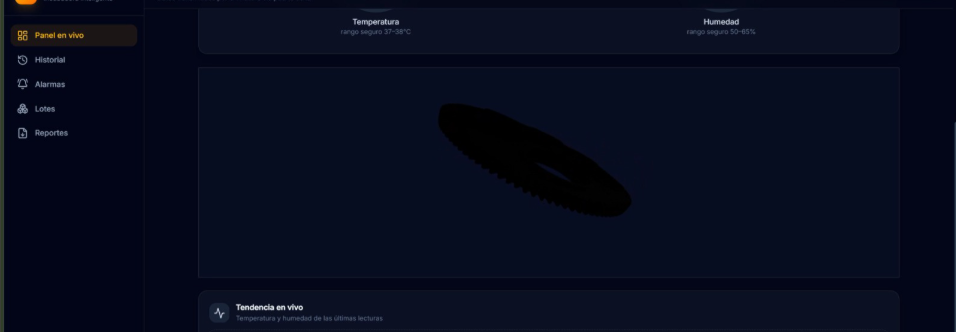


### 18.2. Generación de Reportes


---

## 19. Documentación Complementaria

Documentos de apoyo que acompañan a este README dentro del repositorio:

| Documento | Contenido |
| :--- | :--- |
| [`Docs/manual-usuario.md`](Docs/manual-usuario.md) | Manual de usuario del sistema completo |
| [`Docs/modelo-de-datos.md`](Docs/modelo-de-datos.md) | Modelo de datos en detalle: colecciones, campos e índices |
| [`Docs/guia-de-conexiones.md`](Docs/guia-de-conexiones.md) | Cableado del nodo físico, pin por pin |
| [`Grafana/README.md`](Grafana/README.md) | Datasources y dashboards provisionados |

---

## 20. Historial de Commits en GitHub

> Captura de pantalla del listado/grafo de commits del repositorio en GitHub.
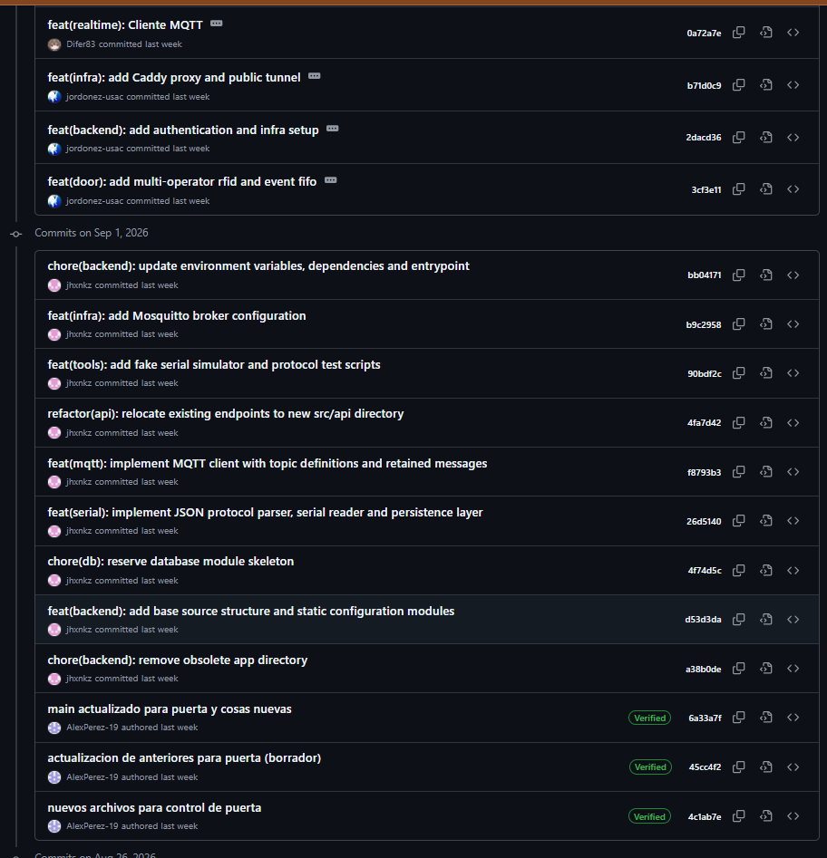

