# SmartEgg — Incubadora Inteligente IoT
## Práctica 1

## Integrantes Grupo #12:

| Nombre | Carné |
| :--- | :--- |
| *Juan Manuel Ordóñez Sandoval* | *202400006* |
| *Héctor Alexander Pérez Natareno* | *202406223* |
| *Jhonatan José Acalón Ajanel* | *202401478* |
| *Jennifer Michelle Rosales Juárez* | *202400063* |
| *Diego Fernando Curtidor Sagui* | *202404402* |
| *Emily Maritza Tepeu Guacamaya* | *202402955* |

---

## 1. Descripción de la Solución

La Facultad de Ciencias Agronómicas de la USAC solicitó el desarrollo de **SmartEgg** que es una incubadora inteligente orientada a pequeños avicultores de la región quienes enfrentan pérdidas de entre el 30% y 40% en sus procesos de incubación por un control impreciso de temperatura y humedad, rotación manual inconsistente de los huevos, ausencia de monitoreo en tiempo real y falta de registros digitales del proceso.

Esta práctica corresponde al **nodo físico** del sistema: el componente embebido que se encarga de sensar el ambiente interno de la incubadora, controlar automáticamente sus actuadores y digitalizar esa información para que pueda ser consultada y almacenada por una plataforma web.

El nodo físico está construido sobre un microcontrolador Arduino Mega que:

- Lee temperatura y humedad mediante un sensor **DHT11**.
- Activa una fuente de calor cuando la temperatura cae por debajo del rango óptimo (37 °C) y un ventilador cuando la supera (38 °C).
- Rota automáticamente un servomotor cada 2 minutos (±45° respecto al centro) para simular el volteo periódico de los huevo evitando que el embrión se adhiera a la cáscara.
- Detecta, mediante finales de carrera, cuántos espacios de la bandeja están disponibles para colocar más huevos.
- Emite una alarma sonora con un buzzer ante condiciones críticas de temperatura o humedad.
- Muestra el estado del sistema en tiempo real en una pantalla LCD 16x2 y permite encender/apagar el sistema físicamente mediante un botón.
- Envía los datos recolectados a la computadora por comunicación serial (UART/USB), donde el backend los recibe, los persiste en una base de datos y los expone mediante una API REST para que se muestren en el frontend web y permita gestionar los lotes de huevos y generar reportes en PDF.

---

## 2. Capas del Framework IoT
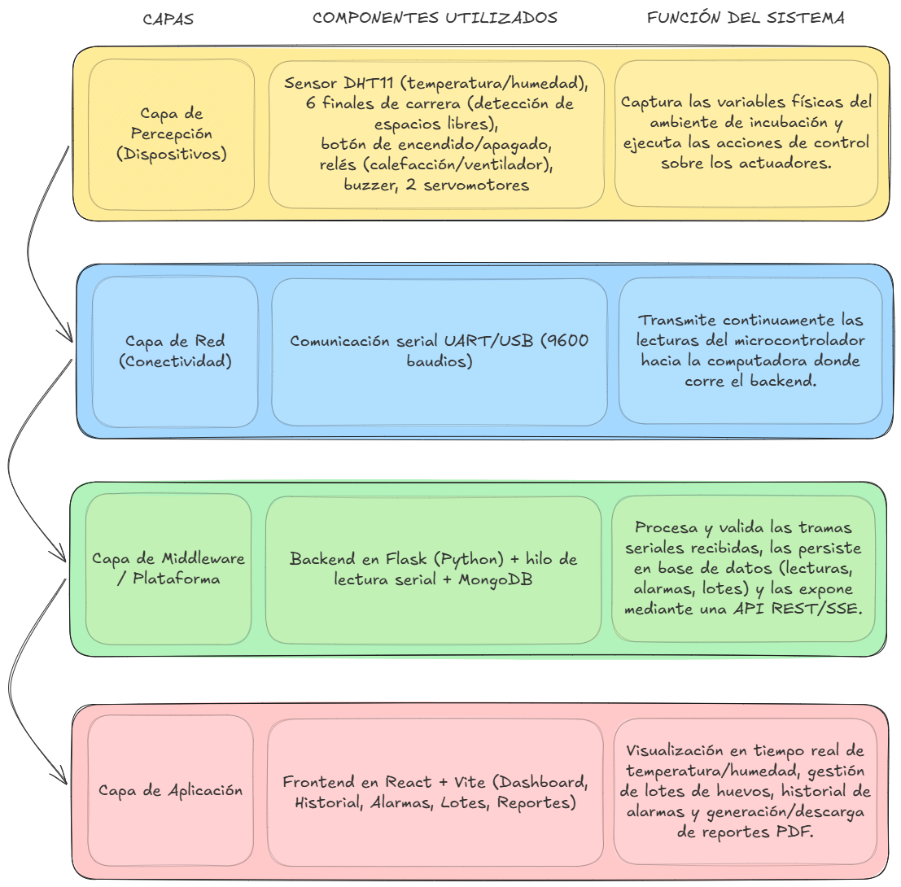

---

## 3. Stack Tecnológico

| Componente | Tecnología |
| :--- | :--- |
| Microcontrolador | Arduino Mega 2560 (ejecuta FreeRTOS para gestionar las tareas concurrentes) |
| Firmware | C++ sobre Arduino IDE |
| Librerías de firmware | `Arduino_FreeRTOS.h`, `task.h`, `semphr.h`, `DHT.h` (Adafruit DHT Sensor Library), `Servo.h`, `Wire.h`, `LiquidCrystal_I2C.h` |
| Backend | Python 3, Flask 3, Flask-CORS |
| Comunicación con el nodo físico | PySerial (lectura de puerto serial en un hilo dedicado) |
| Base de datos | MongoDB (vía PyMongo) |
| Generación de reportes | ReportLab (PDF) |
| Frontend | React 19 + Vite, Tailwind CSS 4, React Router, Recharts, Lucide Icons, React Hot Toast |
| Control de versiones | Git / GitHub |

---

## 4. Fotografías del Prototipo

### 4.1. Mockup del Prototipo
> Diseño previo del ensamblaje físico del prototipo, se muestra el boceto de lo que se pensaba realizar, tomando en cuenta las medidas de cada componente.
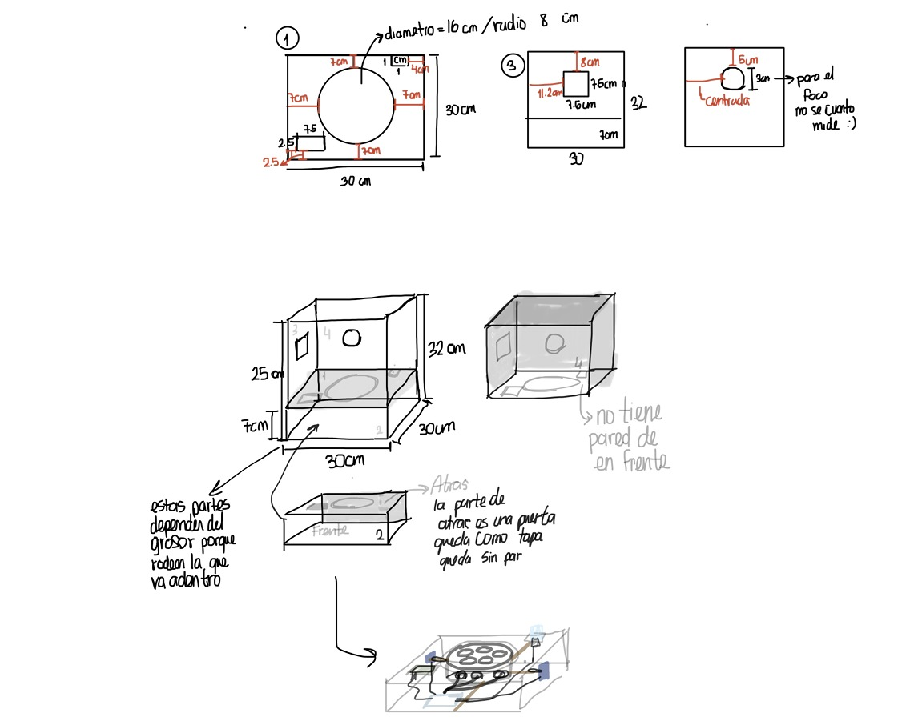
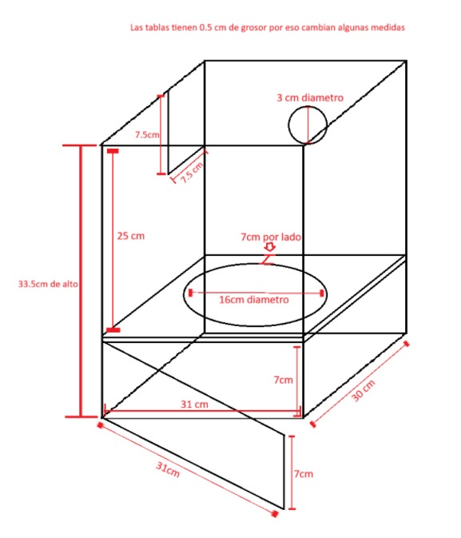


### 4.2. Molde de Huevos Impreso en 3D
> Pieza impresa en 3D diseñada para sostener los huevos dentro de la incubadora: es un molde circular con 6 orificios distribuidos a su alrededor donde se deben poner los huevos. Este molde va alineado con los 6 finales de carrera de la bandeja, de forma que cada orificio es funcional con los sensores y así al colocar o retirar un huevo de su orificio correspondiente, el final de carrera asociado cambia de estado y el sistema actualiza en tiempo real el conteo de espacios disponibles.

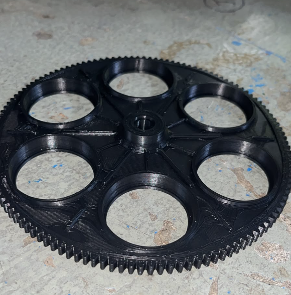


### 4.3. Prototipo Final
> Vista del circuito finalizado, encapsulado en una maqueta de dos niveles: el nivel inferior aloja el Arduino, los relés y todo el cableado (completamente cerrado, sin componentes expuestos, con únicamente el cable USB saliendo hacia la computadora), mientras que el nivel superior corresponde a la incubadora visible, con el molde de huevos impreso en 3D integrado en la parte superior.


---

## 5. Mockups de la Aplicación Web / Móvil

> Diseños de la interfaz de usuario (UI/UX) para las pantallas principales del sistema previos a su implementación.

### Vista Principal
Pantalla con el estado del sistema (encendido/apagado), espacios libres, última lectura recibida, gráfica en vivo de temperatura y humedad, y aviso visual cuando hay una alarma activa.
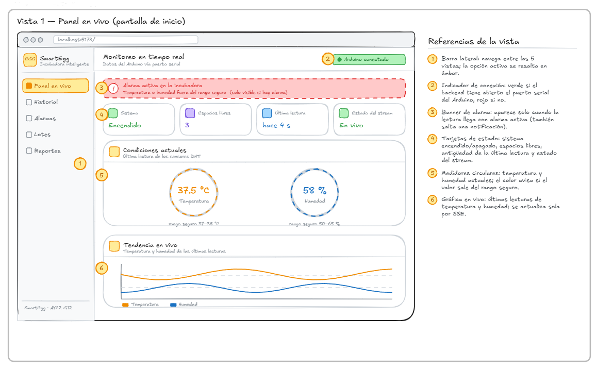

### Vista de Historial y Alarmas
Pantalla con el listado histórico de lecturas de temperatura/humedad y el registro de alarmas generadas por condiciones críticas.


### Vista de Gestión de Lotes
Formulario y listado para registrar la ficha de identificación de cada lote de huevos ingresado a la incubadora (código, nombre del lote, cantidad de huevos, raza, responsable, estado y observaciones).


### Modal de Registro de Lote
Registra un nuevo lote de huevos o edita uno existente. Contiene el formulario con los campos de la ficha de identificación con validación de campos obligatorios antes de guardar.
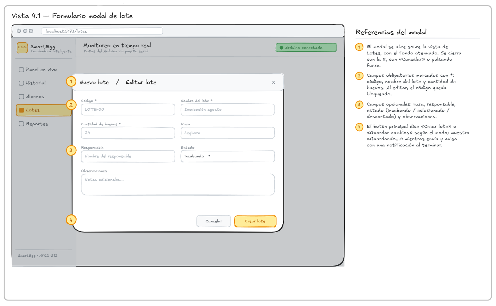

### Vista de Reportes
Pantalla desde la cual se genera y descarga el reporte PDF del día.


---

## 6. Diagrama de Conexiones

> Esquema electrónico del circuito diseñado en Wokwi, mostrando la conexión de cada componente al microcontrolador.
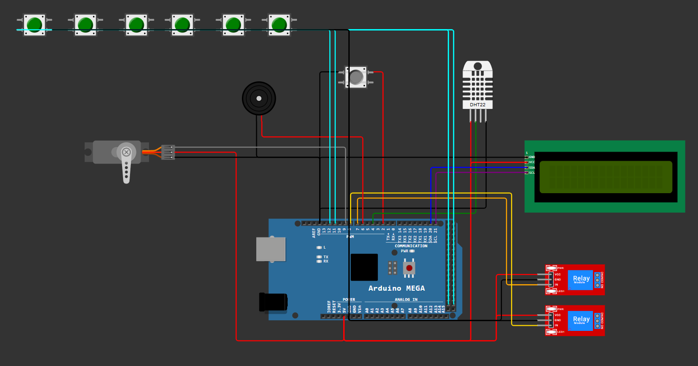

### Tabla de Pines y Conexiones

> Está implementado sobre un **Arduino Mega 2560**.

| Componente | Pin del Componente | Pin del Microcontrolador | Modo / Tipo de Señal |
| :--- | :--- | :--- | :--- |
| Sensor DHT11 | DATA | Pin digital 4 | Digital, un solo hilo (Input) |
| Relé — Calefacción/Luz | IN | Pin digital 7 | Digital (Output, activo en bajo) |
| Relé — Ventilador | IN | Pin digital 8 | Digital (Output, activo en bajo) |
| Buzzer (alarma) | + | Pin digital 6 | Digital (Output) |
| Botón encendido/apagado | Señal | Pin digital 2 | Digital (Input) |
| Servomotor (rotación de bandeja) | Señal (PWM) | Pin digital 9 | PWM (Output) |
| Final de carrera — Espacio 1 | Señal | Pin digital 50 | Digital (Input) |
| Final de carrera — Espacio 2 | Señal | Pin digital 51 | Digital (Input) |
| Final de carrera — Espacio 3 | Señal | Pin digital 52 | Digital (Input) |
| Final de carrera — Espacio 4 | Señal | Pin digital 53 | Digital (Input) |
| Final de carrera — Espacio 5 | Señal | Pin digital 11 | Digital (Input) |
| Final de carrera — Espacio 6 | Señal | Pin digital 12 | Digital (Input) |
| Pantalla LCD 16x2 (módulo I2C) | SDA / SCL | Bus I2C (dirección `0x27`) | I2C (Output) |

---

## 7. Diagrama de Arquitectura de Software

> Diagrama de bloques que muestra el flujo de datos desde el firmware, pasando por el backend, hasta la base de datos y el cliente web.

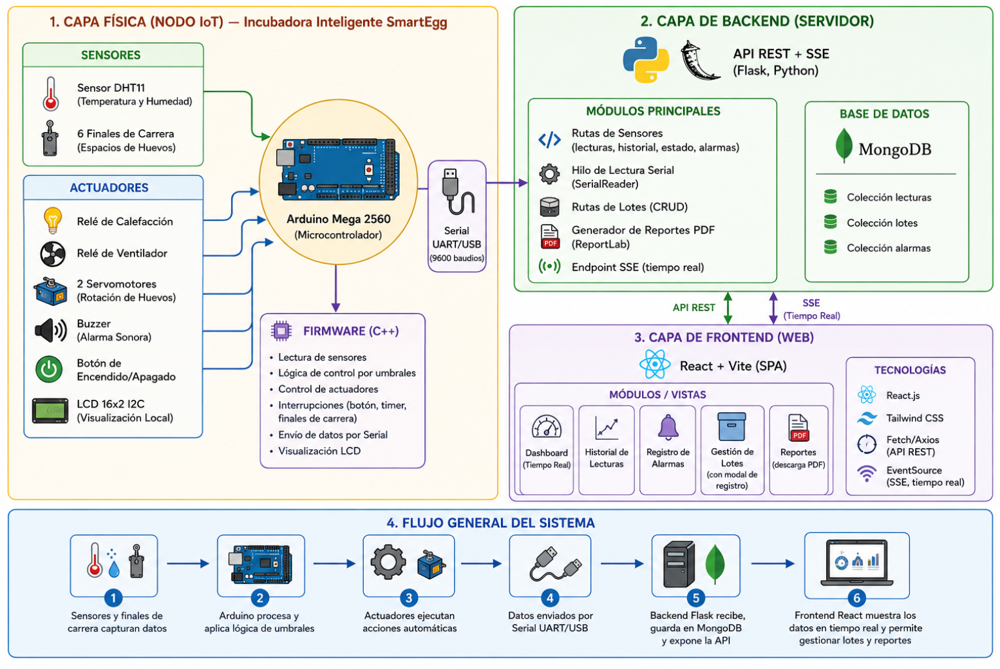

**Flujo general de datos:**

1. El **firmware** (Arduino, C++) lee sensores y controla los actuadores en un ciclo continuo, y cada segundo imprime por el puerto serial el estado actual del sistema (temperatura, humedad, estado del sistema, alarma y espacios libres).
2. El **backend** (Flask) mantiene un hilo dedicado `SerialReader` que escucha el puerto serial de forma continua e interpreta cada línea mediante una expresión regular y la convierte en un objeto `LecturaSensor`.
3. Cada lectura válida se guarda en **MongoDB** (colección `lecturas`) y, si representa una transición a estado de alarma, se registra en la colección `alarmas`.
4. El backend expone esta información mediante una **API REST** y un endpoint de **Server-Sent Events (SSE)** para actualizaciones en tiempo real, además de un endpoint para generar reportes en **PDF**.
5. El **frontend** (React) consume el stream en tiempo real para el Dashboard, consulta el historial y las alarmas mediante REST, y permite gestionar los lotes de huevos y descargar los reportes.

---

## 8. Multitarea con FreeRTOS

### Explicación de la Implementación

Para esta práctica se optó por **FreeRTOS** (`Arduino_FreeRTOS.h`), el firmware crea **6 tareas** en `setup()` mediante `xTaskCreate()`, cada una con su propio periodo fijo (controlado con `vTaskDelayUntil()`, que evita el desfase acumulado tipico de usar `delay()`) y su propia prioridad, de forma que las tareas más sensibles al tiempo (entradas digitales y servomotor) se ejecutan con mayor frecuencia y prioridad que las tareas de reporte (LCD, serial).

Ya que varias tareas necesitan leer y escribir el mismo estado del sistema (temperatura, humedad, si está encendido, si hay alarma, espacios libres), se centralizó ese estado en un módulo aparte (`estado_compartido.h/cpp`) protegido por un **mutex** (`xSemaphoreCreateMutex`). Cada acceso de lectura o escritura toma el mutex (`xSemaphoreTake`) antes de tocar la estructura y lo libera (`xSemaphoreGive`) justo después, evitando condiciones de carrera entre tareas que corren de forma concurrente.

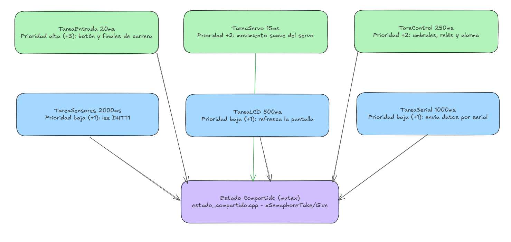

### Tareas Implementadas

| Tarea | Prioridad | Periodo | Descripción |
| :--- | :--- | :--- | :--- |
| `TareaEntradas` | `tskIDLE_PRIORITY + 3` (alta) | 20 ms | Sondea el botón de encendido/apagado y los 6 finales de carrera; actualiza el estado compartido |
| `TareaServo` | `tskIDLE_PRIORITY + 2` | 15 ms | Avanza el servomotor 1° hacia su ángulo objetivo (movimiento suave) y evalúa si toca alternar de posición (cada 2 minutos) |
| `TareaControl` | `tskIDLE_PRIORITY + 2` | 250 ms | Evalúa los umbrales de temperatura/humedad y controla los relés (calefacción/ventilador) y la alarma, apaga todo si el sistema está en OFF |
| `TareaSensores` | `tskIDLE_PRIORITY + 1` | 2000 ms | Lee el sensor DHT11 y actualiza el estado compartido |
| `TareaLCD` | `tskIDLE_PRIORITY + 1` | 500 ms | Refresca la pantalla LCD con el estado actual del sistema |
| `TareaSerial` | `tskIDLE_PRIORITY + 1` | 1000 ms | Envía por el puerto serial la línea con temperatura, humedad, estado, alarma y espacios libres |

### Snippet de Código

```cpp
// Creación de tareas (main.ino)
crearTarea(TareaEntradas, "Entradas", STACK_ENTRADAS, PRIO_ENTRADAS);
crearTarea(TareaSensores, "Sensores", STACK_SENSORES, PRIO_SENSORES);
crearTarea(TareaControl,  "Control",  STACK_CONTROL,  PRIO_CONTROL);
crearTarea(TareaServo,    "Servo",    STACK_SERVO,    PRIO_SERVO);
crearTarea(TareaLCD,      "LCD",      STACK_LCD,      PRIO_LCD);
crearTarea(TareaSerial,   "Serial",   STACK_SERIAL,   PRIO_SERIAL);

vTaskStartScheduler();

// Ejemplo de tarea periódica no bloqueante
static void TareaSensores(void *pvParameters) {
    TickType_t ultimaEjecucion = xTaskGetTickCount();
    for (;;) {
        LecturaSensor lectura = sensors_leer();
        if (lectura.valida) {
            estadoSetLectura(lectura);
        }
        vTaskDelayUntil(&ultimaEjecucion, PERIODO_SENSORES);
    }
}

// Acceso protegido por mutex (estado_compartido.cpp)
void estadoSetLectura(const LecturaSensor &lectura) {
    xSemaphoreTake(estadoMutex, portMAX_DELAY);
    estado.temperatura   = lectura.temperatura;
    estado.humedad       = lectura.humedad;
    estado.lecturaValida = lectura.valida;
    xSemaphoreGive(estadoMutex);
}
```

---

## 9. API Contracts

### 9.1. Protocolo Serial (Firmware → Backend)

* **Puerto:** configurable `SERIAL_PORT`, con autodetección opcional si el puerto configurado no está disponible.
* **Velocidad:** 9600 baudios.
* **Frecuencia de envío:** 1 línea por segundo.
* **Formato de línea (texto plano):**

```
Temperatura: 37.50, Humedad: 55.00, Sistema Encendido: 1, Alarma: 0, Espacios Libres: 4
```

El backend interpreta esta línea mediante una expresión regular y la transforma en un documento JSON antes de persistirla.

### 9.2. API REST (Backend)

**URL base:** `http://localhost:5000` (configurable mediante `FLASK_HOST` / `FLASK_PORT`)

#### Sensores

| Método | Endpoint | Descripción |
| :--- | :--- | :--- |
| `GET` | `/api/sensores/actual` | Devuelve la última lectura recibida del nodo físico |
| `GET` | `/api/sensores/historial?limit=100` | Devuelve el historial de lecturas almacenadas (máximo 1000) |
| `GET` | `/api/sensores/estado` | Devuelve el estado de la conexión serial y qué sensores/actuadores están activos |
| `GET` | `/api/sensores/alarmas?limit=50` | Devuelve las alarmas más recientes (máximo 500) |
| `GET` | `/api/sensores/stream` | Stream en tiempo real (Server-Sent Events) con cada nueva lectura recibida |

**Ejemplo — `GET /api/sensores/actual`**
```json
{
  "id": "66c1f10a1b2c3d4e5f60001",
  "temperatura": 37.5,
  "humedad": 55.0,
  "sistema_encendido": true,
  "alarma": false,
  "espacios_libres": 4,
  "timestamp": "2026-08-14T15:32:10.512000+00:00"
}
```

#### Lotes de Huevos

| Método | Endpoint | Descripción |
| :--- | :--- | :--- |
| `POST` | `/api/lotes` | Crea un nuevo lote (ficha de identificación de huevos ingresados) |
| `GET` | `/api/lotes` | Lista todos los lotes registrados |
| `GET` | `/api/lotes/<id>` | Obtiene un lote específico por su id |
| `PUT` | `/api/lotes/<id>` | Actualiza campos de un lote existente |
| `DELETE` | `/api/lotes/<id>` | Elimina un lote |

**Cuerpo de la petición — `POST /api/lotes`**
```json
{
  "codigo": "LOTE-001",
  "nombre_lote": "Incubación agosto",
  "cantidad_huevos": 24,
  "raza": "Leghorn",
  "responsable": "Nombre del responsable",
  "estado": "incubando",
  "observaciones": "Notas adicionales..."
}
```
* `codigo`, `nombre_lote` y `cantidad_huevos` son obligatorios
* `estado` acepta: `incubando`, `eclosionado` o `descartado`

**Respuesta exitosa (201 Created)**
```json
{
  "id": "66c1f10a1b2c3d4e5f60009",
  "codigo": "LOTE-001",
  "nombre_lote": "Incubación agosto",
  "cantidad_huevos": 24,
  "raza": "Leghorn",
  "responsable": "Nombre del responsable",
  "observaciones": "Notas adicionales...",
  "estado": "incubando",
  "fecha_ingreso": "2026-08-14T15:40:00.000000+00:00"
}
```

#### Reportes

| Método | Endpoint | Descripción |
| :--- | :--- | :--- |
| `GET` | `/api/reportes/pdf?tecnico=Nombre` | Genera y descarga el reporte PDF del día, el cual incluye el técnico responsable, resumen de lotes actuales, temperaturas/humedad máx-mín del día y registro de alarmas |

---

## 10. Fotografías del Prototipo Físico Operando

> Registro de evidencias fotográficas del prototipo ensamblado y operando bajo condiciones reales de prueba.

### 10.1. Dispositivo Encendido y Conectado
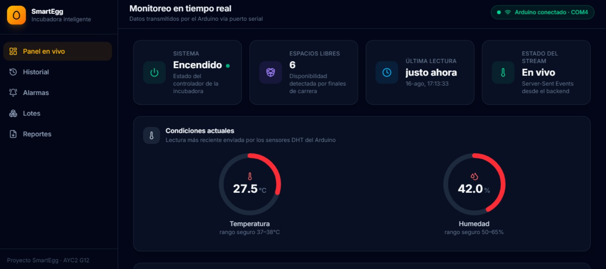

### 10.2. Generación de Reportes
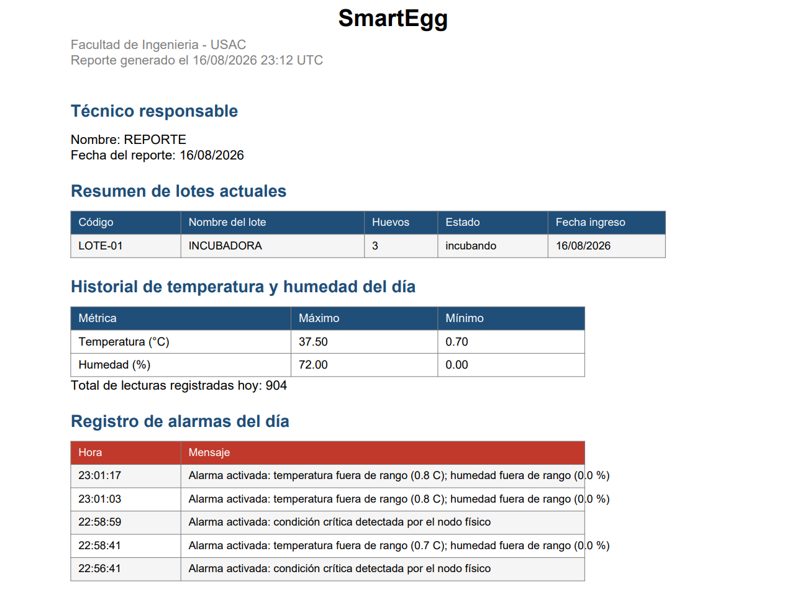

---

## 11. Historial de Commits en GitHub

> Captura de pantalla del listado/grafo de commits del repositorio en GitHub.
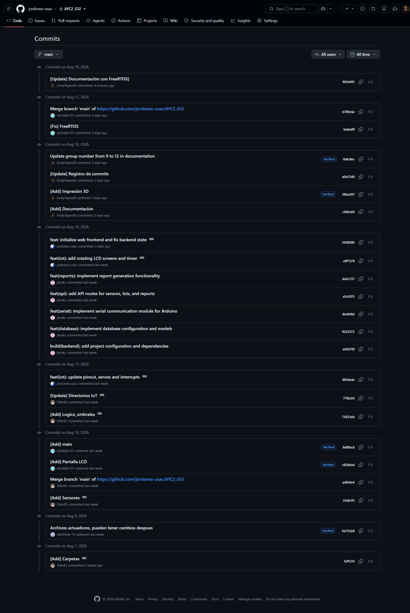

---

## 12. Manual de Usuario

### 12.1. Requisitos Previos

* Arduino Mega 2560 con el firmware de SmartEgg cargado
* Cable USB para la conexión serial entre el Arduino y la computadora
* Python 3.10+ instalado (para el backend)
* Node.js 18+ instalado (para el frontend)
* Una instancia de MongoDB disponible (local o remota)

### 12.2. Puesta en Marcha del Hardware

1. Verifique que todos los componentes estén conectados según la tabla de pines de la sección 6
2. Conecte el Arduino a la computadora mediante el cable USB
3. El sistema arranca **encendido** por defecto y muestra en la pantalla LCD la rotación de tres vistas: temperatura/humedad, estado del sistema/alarma y espacios de huevos disponibles
4. Use el botón físico para alternar entre encendido y apagado del sistema, en modo apagado todos los actuadores se desactivan y la pantalla indica "Modo Standby"

### 12.3. Iniciar el Backend

1. Ingrese a la carpeta `Backend/` e instale las dependencias:
   ```bash
   pip install -r requirements.txt
   ```
2. Cree un archivo `.env` a partir de `.env.example` y configure al menos:
   * `SERIAL_PORT` (por ejemplo `COM3` en Windows o `/dev/ttyACM0` en Linux/Mac)
   * `MONGO_URI` y `MONGO_DB_NAME`
   * `TEMP_MIN`, `TEMP_MAX`, `HUM_MIN`, `HUM_MAX` (deben coincidir con los umbrales del firmware)
3. Ejecute el servidor:
   ```bash
   python run.py
   ```
4. El backend intentará conectarse automáticamente al puerto serial configurado y, si no lo encuentra, intentará autodetectar el primer puerto disponible.

### 12.4. Iniciar el Frontend

1. Ingrese a la carpeta `Frontend/` e instale las dependencias:
   ```bash
   npm install
   ```
2. Cree un archivo `.env` a partir de `.env.example` y configure `VITE_API_BASE_URL` apuntando al backend (por ejemplo `http://localhost:5000`)
3. Ejecute el entorno de desarrollo:
   ```bash
   npm run dev
   ```

### 12.5. Uso de la Interfaz Web

1. Ingrese a la aplicación desde el navegador
2. En al **Dashboard** y consulte en tiempo real la temperatura, humedad, estado del sistema, espacios libres y la hora de la última lectura recibida
3. Ante una condición crítica el sistema mostrará un aviso visual de alarma en el Dashboard
4. En **Historial**, consulte las lecturas anteriores de temperatura y humedad
5. En **Alarmas** consulte el registro de alarmas generadas
6. En **Lotes** registre la ficha de identificación de los huevos ingresados (código, nombre, cantidad, raza, responsable, estado y observaciones), y edítela o elimínela según sea necesario
7. En **Reportes** genere y descargue el reporte PDF del día con el resumen de lotes, temperaturas máximas/mínimas y alarmas registradas

### 12.6. Diagnóstico y Solución de Problemas

| Síntoma | Causa Posible | Solución Sugerida |
| :--- | :--- | :--- |
| El Arduino no enciende | Cable USB defectuoso o alimentación insuficiente | Reemplace el cable o pruebe con otro puerto/fuente |
| El sensor no reporta lecturas válidas | Falso contacto en el cableado del DHT11 o pin incorrecto | Verifique la conexión al pin digital 4 y la alimentación del sensor |
| El Dashboard no muestra datos | El backend no logró conectarse al puerto serial | Revise `/api/sensores/estado`, verifique `SERIAL_PORT` en el `.env` y que ningún otro programa (como el Monitor Serial del Arduino IDE) tenga el puerto abierto |
| Los datos no se actualizan en tiempo real | Falla en el stream SSE o el backend no está corriendo | Revise la consola del backend y confirme que el endpoint `/api/sensores/stream` responde |
| No se puede guardar información | MongoDB no está disponible o `MONGO_URI` es incorrecto | Verifique que el servicio de MongoDB esté activo y la cadena de conexión sea correcta |
| El reporte PDF no se descarga | Error al generar el PDF o no hay datos del día | Revise los logs del backend, el reporte se genera igualmente indicando "sin datos" si no hay lecturas/alarmas/lotes registrados aún |

---